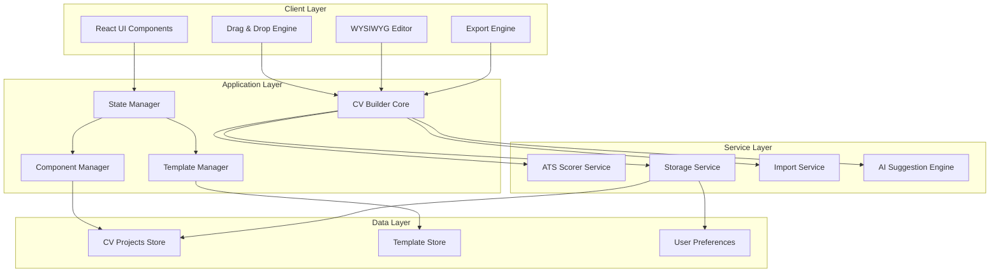
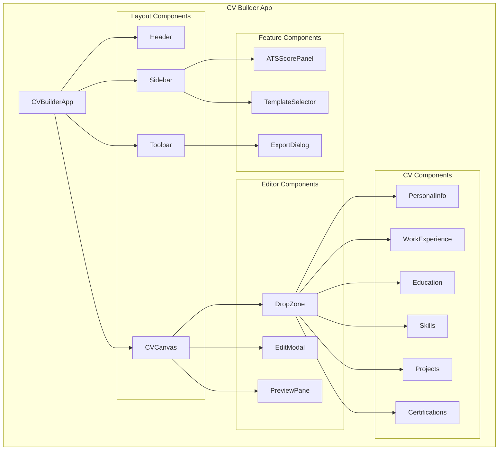

# Design Document - CV Drag-and-Drop Builder

## Overview

Tính năng CV Drag-and-Drop Builder là một ứng dụng web hiện đại cho phép người dùng tạo và chỉnh sửa CV một cách trực quan thông qua giao diện kéo-thả. Hệ thống được thiết kế với kiến trúc modular, tập trung vào hiệu suất, khả năng mở rộng và trải nghiệm người dùng tốt nhất.

### Core Features
- **Real-time WYSIWYG editor**: Chỉnh sửa trực tiếp với preview ngay lập tức
- **Drag-and-drop interface**: Sắp xếp lại các thành phần CV một cách intuitivo
- **ATS integration**: Chấm điểm và đưa ra gợi ý cải thiện theo thời gian thực
- **Template management**: Quản lý và tùy chỉnh các mẫu CV
- **Multi-format export**: Xuất CV dưới nhiều định dạng khác nhau
- **Project management**: Lưu trữ và quản lý nhiều phiên bản CV

### Design Principles
- **Component-based architecture**: Mỗi phần của CV là một component độc lập
- **State-driven UI**: Giao diện phản ánh trạng thái ứng dụng một cách nhất quán
- **Performance-first**: Optimized cho smooth drag-and-drop và real-time updates
- **Extensible design**: Dễ dàng thêm các template và component mới

## Architecture

### System Architecture



### Component Architecture



## Components and Interfaces

### Core Components

#### 1. CVBuilderCore
**Chức năng chính**: Quản lý state tổng thể và điều phối các thành phần

```typescript
interface CVBuilderCore {
  // State management
  currentCV: CVProject;
  isDirty: boolean;
  
  // Core operations
  loadProject(projectId: string): Promise<CVProject>;
  saveProject(project: CVProject): Promise<void>;
  createProject(templateId: string): CVProject;
  
  // Component management
  addComponent(type: CVComponentType, position: Position): void;
  updateComponent(id: string, data: ComponentData): void;
  removeComponent(id: string): void;
  moveComponent(id: string, newPosition: Position): void;
  
  // ATS integration
  requestATSScore(): Promise<ATSScore>;
  getAISuggestions(): Promise<AISuggestion[]>;
}
```

#### 2. DragAndDropEngine
**Chức năng chính**: Xử lý tất cả logic drag-and-drop

```typescript
interface DragAndDropEngine {
  // Drag state
  draggedItem: CVComponent | null;
  dropZones: DropZone[];
  
  // Event handlers
  onDragStart(component: CVComponent, event: DragEvent): void;
  onDragOver(zone: DropZone, event: DragEvent): void;
  onDrop(zone: DropZone, event: DragEvent): void;
  onDragEnd(): void;
  
  // Visual feedback
  highlightDropZones(componentType: CVComponentType): void;
  clearHighlights(): void;
  showDropPreview(zone: DropZone, component: CVComponent): void;
}
```

#### 3. TemplateManager
**Chức năng chính**: Quản lý templates và layouts

```typescript
interface TemplateManager {
  // Template operations
  getAvailableTemplates(): CVTemplate[];
  loadTemplate(templateId: string): CVTemplate;
  applyTemplate(template: CVTemplate, project: CVProject): void;
  
  // Customization
  customizeColors(template: CVTemplate, colors: ColorScheme): CVTemplate;
  getTemplatePreview(templateId: string): string; // Base64 image
}
```

#### 4. ATSIntegrationService
**Chức năng chính**: Tích hợp với hệ thống chấm điểm ATS

```typescript
interface ATSIntegrationService {
  // Scoring
  scoreCV(cvData: CVData): Promise<ATSScore>;
  getScoreHistory(projectId: string): Promise<ATSScore[]>;
  
  // Suggestions
  getImprovementSuggestions(cvData: CVData, score: ATSScore): Promise<AISuggestion[]>;
  validateSuggestion(suggestion: AISuggestion, cvData: CVData): boolean;
}
```

#### 5. ExportEngine
**Chức năng chính**: Xuất CV ra các định dạng khác nhau

```typescript
interface ExportEngine {
  // Export operations
  exportToPDF(project: CVProject): Promise<Blob>;
  exportToPNG(project: CVProject, options: ImageOptions): Promise<Blob>;
  exportToJPG(project: CVProject, options: ImageOptions): Promise<Blob>;
  
  // Quality settings
  setExportQuality(format: ExportFormat, quality: QualitySettings): void;
  previewExport(project: CVProject, format: ExportFormat): Promise<string>;
}
```

### CV Component Interfaces

#### Base CV Component
```typescript
interface CVComponent {
  id: string;
  type: CVComponentType;
  position: Position;
  size: Dimensions;
  data: ComponentData;
  style: ComponentStyle;
  isEditable: boolean;
  isVisible: boolean;
}

enum CVComponentType {
  PERSONAL_INFO = 'personal_info',
  WORK_EXPERIENCE = 'work_experience',
  EDUCATION = 'education',
  SKILLS = 'skills',
  PROJECTS = 'projects',
  CERTIFICATIONS = 'certifications',
  INTERESTS = 'interests'
}
```

#### Specific Component Data Types
```typescript
interface PersonalInfoData extends ComponentData {
  fullName: string;
  email: string;
  phone: string;
  location: string;
  linkedIn?: string;
  website?: string;
  summary?: string;
}

interface WorkExperienceData extends ComponentData {
  experiences: {
    company: string;
    position: string;
    startDate: Date;
    endDate?: Date;
    description: string[];
    location: string;
  }[];
}

interface EducationData extends ComponentData {
  education: {
    institution: string;
    degree: string;
    field: string;
    startDate: Date;
    endDate?: Date;
    gpa?: number;
    achievements?: string[];
  }[];
}

interface SkillsData extends ComponentData {
  skillCategories: {
    category: string;
    skills: string[];
    level?: 'beginner' | 'intermediate' | 'advanced' | 'expert';
  }[];
}
```

## Data Models

### Core Data Models

#### CVProject Model
```typescript
interface CVProject {
  id: string;
  userId: string;
  name: string;
  templateId: string;
  
  // Content
  components: CVComponent[];
  layout: LayoutConfiguration;
  
  // Metadata
  createdAt: Date;
  updatedAt: Date;
  lastATSScore?: ATSScore;
  tags: string[];
  
  // Settings
  exportSettings: ExportSettings;
  customStyles: CustomStyles;
}
```

#### CVTemplate Model
```typescript
interface CVTemplate {
  id: string;
  name: string;
  category: 'traditional' | 'modern' | 'creative';
  
  // Layout
  layout: LayoutConfiguration;
  defaultComponents: CVComponentType[];
  componentStyles: Record<CVComponentType, ComponentStyle>;
  
  // Customization
  colorSchemes: ColorScheme[];
  fonts: FontConfiguration[];
  
  // Metadata
  previewImage: string; // Base64 or URL
  isDefault: boolean;
  tags: string[];
}
```

#### ATSScore Model
```typescript
interface ATSScore {
  overall: number; // 0-100
  breakdown: {
    keywords: number;
    formatting: number;
    sections: number;
    contactInfo: number;
    readability: number;
    length: number;
  };
  
  // Improvements
  suggestions: AISuggestion[];
  missingKeywords: string[];
  formatIssues: FormatIssue[];
  
  // Metadata
  analyzedAt: Date;
  jobDescription?: string;
}
```

#### AISuggestion Model
```typescript
interface AISuggestion {
  id: string;
  type: 'content' | 'format' | 'structure' | 'keywords';
  priority: 'low' | 'medium' | 'high';
  
  // Suggestion details
  title: string;
  description: string;
  component?: CVComponentType;
  
  // Implementation
  action: SuggestionAction;
  isApplied: boolean;
  
  // Validation
  confidence: number; // 0-1
  disclaimer?: string;
}

interface SuggestionAction {
  type: 'add' | 'modify' | 'reorder' | 'style';
  target: string; // Component ID hoặc property path
  value?: any;
}
```

### Layout and Style Models

#### Layout Configuration
```typescript
interface LayoutConfiguration {
  type: 'single-column' | 'two-column' | 'three-column';
  columns: ColumnDefinition[];
  spacing: SpacingConfiguration;
  margins: MarginConfiguration;
}

interface ColumnDefinition {
  id: string;
  width: number; // Percentage
  minHeight: number;
  components: string[]; // Component IDs
}
```

#### Style Models
```typescript
interface ComponentStyle {
  background: string;
  border: BorderStyle;
  padding: SpacingValues;
  margin: SpacingValues;
  font: FontStyle;
  color: string;
}

interface ColorScheme {
  primary: string;
  secondary: string;
  accent: string;
  text: string;
  background: string;
  border: string;
}

interface FontStyle {
  family: string;
  size: number;
  weight: 'normal' | 'bold' | '100' | '200' | '300' | '400' | '500' | '600' | '700' | '800' | '900';
  lineHeight: number;
}
```

### Import/Export Models

#### Import Configuration
```typescript
interface ImportConfiguration {
  supportedFormats: ('pdf' | 'docx' | 'txt')[];
  extractionMethod: 'ocr' | 'text-parsing' | 'ml-extraction';
  fallbackStrategy: 'manual-entry' | 'template-guided';
}

interface ImportResult {
  success: boolean;
  extractedData: Partial<CVProject>;
  confidence: number;
  errors: ImportError[];
  suggestions: ImportSuggestion[];
}
```

#### Export Settings
```typescript
interface ExportSettings {
  format: ExportFormat;
  quality: QualitySettings;
  includeMetadata: boolean;
  customSize?: PaperSize;
}

interface QualitySettings {
  dpi: number;
  compression: number; // 0-100
  colorProfile: 'sRGB' | 'CMYK' | 'grayscale';
}

enum ExportFormat {
  PDF = 'pdf',
  PNG = 'png',
  JPG = 'jpg'
}
```

## Error Handling

### Error Classification
```typescript
interface CVBuilderError extends Error {
  code: ErrorCode;
  severity: 'low' | 'medium' | 'high' | 'critical';
  context: ErrorContext;
  recovery?: RecoveryAction[];
}

enum ErrorCode {
  // Template errors
  TEMPLATE_NOT_FOUND = 'TEMPLATE_NOT_FOUND',
  TEMPLATE_LOAD_FAILED = 'TEMPLATE_LOAD_FAILED',
  
  // Component errors
  COMPONENT_VALIDATION_FAILED = 'COMPONENT_VALIDATION_FAILED',
  COMPONENT_RENDER_FAILED = 'COMPONENT_RENDER_FAILED',
  
  // ATS errors
  ATS_SERVICE_UNAVAILABLE = 'ATS_SERVICE_UNAVAILABLE',
  ATS_SCORE_TIMEOUT = 'ATS_SCORE_TIMEOUT',
  
  // Export errors
  EXPORT_GENERATION_FAILED = 'EXPORT_GENERATION_FAILED',
  EXPORT_SIZE_EXCEEDED = 'EXPORT_SIZE_EXCEEDED',
  
  // Storage errors
  SAVE_FAILED = 'SAVE_FAILED',
  LOAD_FAILED = 'LOAD_FAILED',
  
  // Import errors
  IMPORT_FORMAT_UNSUPPORTED = 'IMPORT_FORMAT_UNSUPPORTED',
  IMPORT_EXTRACTION_FAILED = 'IMPORT_EXTRACTION_FAILED'
}
```

### Error Handling Strategies

#### Template Loading Errors
- **Fallback**: Load default template if specific template fails
- **Recovery**: Offer template selection dialog
- **User feedback**: Clear error message with retry option

#### ATS Service Errors
- **Timeout handling**: Cancel request after 10 seconds
- **Retry mechanism**: Exponential backoff up to 3 attempts
- **Graceful degradation**: Continue editing without ATS score

#### Component Validation Errors
- **Real-time validation**: Show inline error messages
- **Auto-correction**: Fix minor formatting issues automatically
- **User guidance**: Provide suggestions for fixing validation errors

#### Export Errors
- **Format fallback**: Try alternative export format if primary fails
- **Quality adjustment**: Reduce quality/size if export too large
- **Partial export**: Offer to export individual pages on failure

#### Auto-save Errors
- **Local backup**: Store changes in localStorage as backup
- **Retry mechanism**: Attempt save every 30 seconds until successful
- **User notification**: Show persistent notification of unsaved changes

## Testing Strategy

### Testing Approach
Tính năng CV Drag-and-Drop Builder yêu cầu phương pháp testing đa dạng để đảm bảo chất lượng cao:

#### Unit Testing
- **Component logic**: Test từng CV component riêng biệt
- **State management**: Verify state transitions và data flow
- **Utility functions**: Test các helper functions cho validation, formatting
- **API integration**: Mock external services cho isolated testing

#### Integration Testing  
- **Drag-and-drop flow**: End-to-end testing của drag-and-drop interactions
- **ATS integration**: Test real-time scoring với mocked ATS service
- **Template application**: Verify template loading và customization
- **Export pipeline**: Test complete export process cho các formats

#### Visual Regression Testing
- **Template rendering**: Screenshot testing cho template consistency
- **Component layouts**: Ensure components render correctly across templates
- **Export output**: Visual comparison của exported files

#### Performance Testing
- **Drag responsiveness**: Measure lag during drag operations (< 16ms target)
- **Real-time updates**: Test performance với concurrent editing và ATS analysis
- **Memory usage**: Monitor memory leaks trong extended editing sessions
- **Load testing**: Stress test với large CVs và multiple concurrent users

#### Accessibility Testing
- **Keyboard navigation**: Ensure full keyboard accessibility cho drag-and-drop
- **Screen reader support**: Test với ARIA labels và semantic markup
- **Color contrast**: Verify WCAG compliance cho all templates
- **Focus management**: Test focus handling trong modal dialogs và editing states

#### Cross-browser Testing
- **Desktop browsers**: Chrome, Firefox, Safari, Edge
- **Mobile responsive**: Test touch interactions trên mobile devices
- **Feature detection**: Graceful degradation cho unsupported browsers

### Testing Framework Setup
- **Unit tests**: Jest + React Testing Library
- **Integration tests**: Cypress hoặc Playwright
- **Visual tests**: Percy hoặc Chromatic
- **Performance tests**: Lighthouse CI + custom metrics
- **Accessibility tests**: axe-core integration

### Test Data Management
- **Fixture data**: Standardized CV data cho consistent testing
- **Template variations**: Test suite covering all template types
- **Edge cases**: Unusual data combinations và boundary conditions
- **Internationalization**: Test với multi-language content

### Property-Based Testing Assessment

Property-based testing (PBT) is **not appropriate** for this feature due to its nature:

**Why PBT doesn't apply here:**
- **UI-heavy feature**: The core functionality involves drag-and-drop interactions, WYSIWYG editing, and visual rendering
- **External integrations**: Heavy reliance on ATS service, file import/export, and template rendering
- **User interface behavior**: Most requirements test UI interactions, visual feedback, and user workflows rather than algorithmic properties
- **Side-effect operations**: Many operations involve file I/O, API calls, and DOM manipulation

**Alternative testing strategies used instead:**
- **Unit tests**: For component logic, validation functions, and utility methods
- **Integration tests**: For ATS integration, template loading, and export functionality  
- **Visual regression tests**: For template rendering consistency and layout preservation
- **Performance tests**: For drag responsiveness and real-time updates
- **Cross-browser tests**: For compatibility across desktop browsers
- **Accessibility tests**: For keyboard navigation and screen reader support

This testing approach provides comprehensive coverage appropriate for a complex UI feature without forcing property-based testing where it doesn't add value.