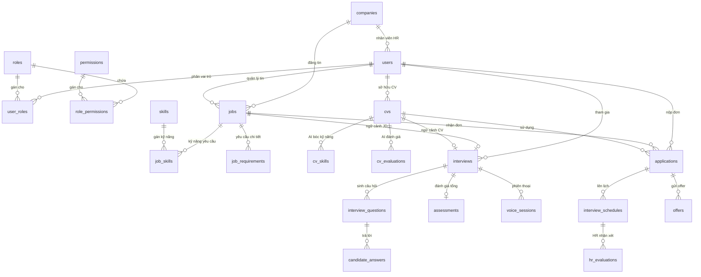

# Tài liệu Chi tiết Cấu trúc Cơ sở dữ liệu - MockAI-Interview

Tài liệu này giải thích chi tiết về **công dụng**, **cấu trúc cột**, và **mối quan hệ** giữa 41 bảng hiện có trong cơ sở dữ liệu của dự án **MockAI-Interview** (Sử dụng PostgreSQL kết hợp với Knex.js làm Query Builder).

---

## 🗺️ Sơ đồ Mối Quan Hệ Tổng Quan (Mermaid ERD)

Dưới đây là sơ đồ trực quan hóa các mối quan hệ (1-N, N-N, 1-1) giữa các bảng cốt lõi trong hệ thống:

---

## 📂 Chi Tiết Từng Phân Hệ & Công Dụng Các Bảng

Hệ thống cơ sở dữ liệu được chia thành **6 phân nhóm chức năng chính** để dễ quản lý và theo dõi logic.

---

### 👤 1. Phân hệ Xác thực & Phân quyền (Auth & RBAC)

Phân hệ này kiểm soát thông tin tài khoản người dùng và hệ thống phân quyền dựa trên vai trò (Role-Based Access Control) giúp quản lý truy cập an toàn.

#### 1.1 `users`
*   **Công dụng**: Lưu trữ thông tin cá nhân, tài khoản đăng nhập và liên kết doanh nghiệp của mọi người dùng trong hệ thống (ADMIN, HR, USER/Candidate).
*   **Các trường cốt lõi**:
    *   `id` (Primary Key - Increments)
    *   `email` (String - Unique): Địa chỉ email đăng nhập.
    *   `password_hash` (String): Mật khẩu đã mã hóa bằng bcryptjs.
    *   `full_name` (String): Họ và tên đầy đủ.
    *   `phone`, `avatar_url`, `bio`, `date_of_birth`, `address` (Nullable): Thông tin hồ sơ cá nhân bổ sung.
    *   `is_active` (Boolean - Default: true): Trạng thái hoạt động của tài khoản.
    *   `email_verified` (Boolean - Default: false): Đã xác thực email hay chưa.
    *   `company_id` (Integer - Foreign Key -> `companies`): Gắn kết HR vào công ty tương ứng.
*   **Mối quan hệ**:
    *   Liên kết **N-1** với bảng `companies` (Nhiều users có thể thuộc 1 công ty).
    *   Liên kết **1-N** với các bảng: `user_roles`, `cvs`, `interviews`, `applications`, `saved_jobs`, `company_followers`, `job_alerts`, `notifications`, `feedbacks`, `reports`, `transactions`.

#### 1.2 `roles`
*   **Công dụng**: Định nghĩa các vai trò có trong hệ thống (ví dụ: `ADMIN`, `HR`, `USER`).
*   **Các trường cốt lõi**:
    *   `id` (PK)
    *   `name` (String - Unique - Not Null): Tên vai trò.
    *   `description` (String): Mô tả chi tiết vai trò.
*   **Mối quan hệ**:
    *   Liên kết **1-N** với bảng `user_roles`.
    *   Liên kết **1-N** với bảng `role_permissions`.

#### 1.3 `permissions`
*   **Công dụng**: Lưu trữ danh mục các quyền hạn chi tiết trong hệ thống (ví dụ: `create_job`, `delete_user`, `view_cv`).
*   **Các trường cốt lõi**:
    *   `id` (PK)
    *   `name` (String - Unique - Not Null): Tên định danh quyền.
    *   `description` (String): Mô tả chức năng của quyền.
*   **Mối quan hệ**:
    *   Liên kết **1-N** với bảng `role_permissions` để phân bổ quyền cho các vai trò.

#### 1.4 `role_permissions`
*   **Công dụng**: Bảng trung gian ánh xạ quan hệ **Nhiều-Nhiều (N-N)** giữa `roles` và `permissions`.
*   **Các trường cốt lõi**:
    *   `id` (PK)
    *   `role_id` (Integer - FK -> `roles` - Cascade)
    *   `permission_id` (Integer - FK -> `permissions` - Cascade)
*   **Ràng buộc**: Khóa unique kết hợp `['role_id', 'permission_id']` để chống trùng lặp dữ liệu.

#### 1.5 `user_roles`
*   **Công dụng**: Bảng trung gian ánh xạ quan hệ **Nhiều-Nhiều (N-N)** giữa `users` và `roles` (Một người dùng có thể mang nhiều vai trò khác nhau).
*   **Các trường cốt lõi**:
    *   `id` (PK)
    *   `user_id` (Integer - FK -> `users` - Cascade)
    *   `role_id` (Integer - FK -> `roles` - Cascade)
*   **Ràng buộc**: Khóa unique kết hợp `['user_id', 'role_id']`.

#### 1.6 `password_resets`
*   **Công dụng**: Lưu trữ thông tin mã token dùng cho luồng khôi phục mật khẩu khi người dùng yêu cầu.
*   **Các trường cốt lõi**:
    *   `id` (PK)
    *   `user_id` (Integer - FK -> `users` - Cascade)
    *   `token` (String - Unique): Mã token xác thực gửi qua email.
    *   `expires_at` (Timestamp): Thời gian hết hạn của token.
    *   `is_used` (Boolean - Default: false): Đã sử dụng token hay chưa.

---

### 💼 2. Phân hệ Tin tuyển dụng & Doanh nghiệp (Job & Recruitment)

Quản lý thông tin hồ sơ của các công ty và chi tiết tin đăng tuyển dụng cùng các yêu cầu tuyển dụng liên quan.

#### 2.1 `companies`
*   **Công dụng**: Lưu trữ hồ sơ thông tin doanh nghiệp/nhà tuyển dụng.
*   **Các trường cốt lõi**:
    *   `id` (PK)
    *   `name` (String - Not Null): Tên doanh nghiệp.
    *   `logo_url`, `website`, `industry`, `company_size`, `description`, `address`, `phone`, `email`
    *   `tax_code` (String - Unique): Mã số thuế phục vụ xác minh doanh nghiệp.
    *   `is_verified` (Boolean - Default: false): Đã được Admin phê duyệt tài khoản doanh nghiệp.
*   **Mối quan hệ**:
    *   Liên kết **1-N** với bảng `users` (Một công ty có nhiều HR).
    *   Liên kết **1-N** với bảng `jobs` (Một công ty có nhiều tin tuyển dụng).
    *   Liên kết **1-N** với bảng `company_followers` (Theo dõi từ Candidate).
    *   Liên kết **1-N** với bảng `email_templates` (Mẫu email tùy biến riêng của công ty).

#### 2.2 `categories`
*   **Công dụng**: Danh mục ngành nghề/lĩnh vực công việc (ví dụ: Công nghệ thông tin, Thiết kế đồ họa, Marketing).
*   **Các trường cốt lõi**:
    *   `id` (PK)
    *   `name` (String - Unique), `slug` (String - Unique), `icon` (String), `is_active` (Boolean).
*   **Mối quan hệ**:
    *   Liên kết **1-N** với bảng `skills` (Chia nhóm kỹ năng theo ngành nghề).
    *   Liên kết **1-N** với bảng `jobs` (Xác định tin tuyển dụng thuộc lĩnh vực nào).

#### 2.3 `skills`
*   **Công dụng**: Danh mục kỹ năng nghiệp vụ/kỹ thuật toàn cục của hệ thống (ví dụ: React, SQL, Photoshop).
*   **Các trường cốt lõi**:
    *   `id` (PK)
    *   `name` (String - Unique), `slug` (String - Unique)
    *   `category_id` (Integer - FK -> `categories` - Set Null): Thuộc lĩnh vực ngành nghề nào.
    *   `is_active` (Boolean).
*   **Mối quan hệ**:
    *   Liên kết **1-N** với bảng trung gian `job_skills` (Kỹ năng yêu cầu của job).
    *   Liên kết **1-N** với bảng trung gian `user_skills` (Kỹ năng sở hữu của user).

#### 2.4 `locations`
*   **Công dụng**: Danh mục các địa điểm/tỉnh thành làm việc (ví dụ: TP. Hồ Chí Minh, Hà Nội, Đà Nẵng).
*   **Các trường cốt lõi**:
    *   `id` (PK)
    *   `name` (String), `slug` (String - Unique), `region` (String - Miền Bắc, Trung, Nam), `is_active` (Boolean).
*   **Mối quan hệ**:
    *   Liên kết **1-N** với bảng `jobs` (Địa điểm làm việc của tin tuyển dụng).

#### 2.5 `job_types`
*   **Công dụng**: Hình thức làm việc của công việc (ví dụ: Full-time, Part-time, Remote, Internship).
*   **Các trường cốt lõi**:
    *   `id` (PK)
    *   `name` (String - Unique), `slug` (String - Unique), `is_active` (Boolean).
*   **Mối quan hệ**:
    *   Liên kết **1-N** với bảng `jobs` (Quy định hình thức làm việc của job).

#### 2.6 `jobs`
*   **Công dụng**: Lưu trữ thông tin chi tiết các tin tuyển dụng do HR đăng tải. Đây là dữ liệu nguồn quan trọng để AI phân tích và đưa ra câu hỏi phỏng vấn tương ứng.
*   **Các trường cốt lõi**:
    *   `id` (PK)
    *   `hr_id` (Integer - FK -> `users` - Cascade): HR quản lý tin.
    *   `company_id` (Integer - FK -> `companies` - Cascade): Thuộc về công ty đăng tuyển.
    *   `title` (String - Not Null): Tiêu đề tin tuyển dụng.
    *   `description` (Text), `requirements` (Text): Chi tiết công việc và yêu cầu.
    *   `status` (String - Default: 'OPEN'): Trạng thái tin (`OPEN`, `CLOSED`).
    *   `category_id`, `location_id`, `job_type_id` (FK -> các danh mục tương ứng).
    *   `experience_level` (String): Cấp bậc yêu cầu (`INTERN`, `JUNIOR`, `MID`, `SENIOR`, `LEAD`).
    *   `salary_min`, `salary_max` (Decimal), `salary_currency` (String), `is_salary_visible` (Boolean).
    *   `vacancy_count` (Integer): Số lượng tuyển dụng.
    *   `deadline` (Timestamp): Hạn chót ứng tuyển.
    *   `approval_status` (String - Default: 'PENDING'): Trạng thái phê duyệt tin (`PENDING`, `APPROVED`, `REJECTED`).
    *   `approved_by` (Integer - FK -> `users`): Admin thực hiện duyệt tin.
    *   `approved_at` (Timestamp).
    *   `view_count` (Integer): Lượt xem tin.
*   **Mối quan hệ**:
    *   Liên kết **1-N** với bảng `job_skills`, `job_requirements`, `interviews`, `saved_jobs`, `applications`.

#### 2.7 `job_skills`
*   **Công dụng**: Bảng trung gian ánh xạ quan hệ **Nhiều-Nhiều (N-N)** giữa `jobs` và `skills` nhằm chỉ ra tin tuyển dụng yêu cầu cụ thể những kỹ năng nào.
*   **Các trường cốt lõi**:
    *   `id` (PK)
    *   `job_id` (Integer - FK -> `jobs` - Cascade)
    *   `skill_id` (Integer - FK -> `skills` - Cascade)
*   **Ràng buộc**: Khóa unique `['job_id', 'skill_id']`.

#### 2.8 `job_requirements`
*   **Công dụng**: Chi tiết hóa từng đầu mục yêu cầu của tin tuyển dụng, quy định rõ yêu cầu nào là bắt buộc hay tùy chọn.
*   **Các trường cốt lõi**:
    *   `id` (PK)
    *   `job_id` (Integer - FK -> `jobs` - Cascade): Liên kết tin tuyển dụng.
    *   `requirement_text` (Text - Not Null): Mô tả chi tiết yêu cầu.
    *   `is_mandatory` (Boolean - Default: true): Yêu cầu bắt buộc hay không.

---

### 📄 3. Phân hệ Hồ sơ năng lực (CV & ATS Scoring)

Quản lý các file CV của ứng viên tải lên hệ thống, lưu kết quả AI trích xuất thông tin kỹ năng và chấm điểm đánh giá CV theo thang điểm ATS.

#### 3.1 `cvs`
*   **Công dụng**: Lưu trữ đường dẫn tệp CV, văn bản thô bóc tách từ CV và kết quả đánh giá sơ bộ của AI.
*   **Các trường cốt lõi**:
    *   `id` (PK)
    *   `user_id` (Integer - FK -> `users` - Cascade): Chủ sở hữu CV.
    *   `file_url` (String): Đường dẫn lưu trữ file CV (PDF/Docx).
    *   `parsed_text` (Text): Nội dung văn bản trích xuất được từ CV dùng để nạp vào AI.
    *   `ats_score` (Integer): Điểm số đánh giá độ tương thích của CV (Thang điểm ATS).
    *   `ai_feedback` (Text): Nhận xét chung của AI và gợi ý nâng cấp CV.
*   **Mối quan hệ**:
    *   Liên kết **1-N** với `cv_skills`, `cv_evaluations`, `interviews`, `applications`.

#### 3.2 `cv_skills`
*   **Công dụng**: Lưu trữ các kỹ năng chuyên môn do AI bóc tách trực tiếp từ văn bản CV của ứng viên cùng với số năm kinh nghiệm dự kiến tương ứng.
*   **Các trường cốt lõi**:
    *   `id` (PK)
    *   `cv_id` (Integer - FK -> `cvs` - Cascade): Thuộc CV nào.
    *   `skill_name` (String - Not Null): Tên kỹ năng AI bóc tách.
    *   `experience_years` (Integer): Số năm kinh nghiệm tương ứng.

#### 3.3 `cv_evaluations`
*   **Công dụng**: Lưu trữ điểm số chi tiết và nhận xét của AI phân tích dựa trên từng tiêu chuẩn đánh giá CV cụ thể.
*   **Các trường cốt lõi**:
    *   `id` (PK)
    *   `cv_id` (Integer - FK -> `cvs` - Cascade): Thuộc CV nào.
    *   `criterion_name` (String - Not Null): Tiêu chí chấm điểm (`Education`, `Work Experience`, `Tech Skills`, `Soft Skills`).
    *   `score` (Integer - Not Null): Điểm số của tiêu chí.
    *   `feedback` (Text): Nhận xét chi tiết cho tiêu chí này.

#### 3.4 `user_skills`
*   **Công dụng**: Bảng trung gian ánh xạ quan hệ **Nhiều-Nhiều (N-N)** giữa `users` và `skills` biểu diễn các kỹ năng mà ứng viên tự khai báo trên trang cá nhân.
*   **Các trường cốt lõi**:
    *   `id` (PK)
    *   `user_id` (Integer - FK -> `users` - Cascade)
    *   `skill_id` (Integer - FK -> `skills` - Cascade)
    *   `proficiency_level` (String): Mức độ thành thạo (`BEGINNER`, `INTERMEDIATE`, `ADVANCED`, `EXPERT`).
    *   `years_of_experience` (Integer): Số năm kinh nghiệm.
*   **Ràng buộc**: Khóa unique `['user_id', 'skill_id']`.

---

### 🤖 4. Phân hệ Phỏng vấn AI & Giọng nói (AI Interview & Voice)

Đây là phân hệ cốt lõi điều phối quá trình phỏng vấn thử hoặc phỏng vấn thực tế thời gian thực giữa Ứng viên với AI (Text và Voice).

#### 4.1 `interviews`
*   **Công dụng**: Lưu thông tin quản lý chung cho mỗi phiên phỏng vấn.
*   **Các trường cốt lõi**:
    *   `id` (PK)
    *   `user_id` (Integer - FK -> `users` - Cascade): Ứng viên tham gia phỏng vấn.
    *   `cv_id` (Integer - FK -> `cvs` - Set Null): CV cung cấp làm ngữ cảnh phỏng vấn.
    *   `job_id` (Integer - FK -> `jobs` - Set Null): Job cung cấp ngữ cảnh phỏng vấn (dành cho phỏng vấn thực tế ứng tuyển).
    *   `type` (String - Default: 'PRACTICE'): Hình thức phỏng vấn (`PRACTICE` - Luyện tập tự do, `REAL` - Phỏng vấn tuyển dụng).
    *   `status` (String - Default: 'PENDING'): Trạng thái cuộc phỏng vấn (`PENDING`, `IN_PROGRESS`, `COMPLETED`).
    *   `started_at`, `ended_at` (Timestamp).
    *   `custom_position`, `custom_skills`, `experience_level` (String - Nullable): Các tùy chọn cấu hình thủ công nếu ứng viên chọn phỏng vấn luyện tập tự chọn không theo Job/CV có sẵn.
*   **Mối quan hệ**:
    *   Liên kết **1-N** với các bảng: `interview_questions`, `interview_messages`, `voice_sessions`.
    *   Liên kết **1-1** với bảng `assessments` (Mỗi buổi phỏng vấn có tối đa một bản đánh giá tổng kết).

#### 4.2 `interview_questions`
*   **Công dụng**: Bộ các câu hỏi phỏng vấn do AI tạo ra dành riêng cho phiên phỏng vấn dựa trên CV và JD.
*   **Các trường cốt lõi**:
    *   `id` (PK)
    *   `interview_id` (Integer - FK -> `interviews` - Cascade): Thuộc buổi phỏng vấn nào.
    *   `question_text` (Text - Not Null): Câu hỏi chi tiết từ AI.
    *   `expected_answer` (Text): Gợi ý câu trả lời mong đợi hoặc các ý chính cần có.
    *   `score_weight` (Integer - Default: 1): Trọng số của câu hỏi.
*   **Mối quan hệ**:
    *   Liên kết **1-N** với bảng `candidate_answers` (Lưu câu trả lời tương ứng).

#### 4.3 `candidate_answers`
*   **Công dụng**: Lưu trữ câu trả lời, file ghi âm giọng nói và đánh giá chấm điểm của AI cho từng câu hỏi cụ thể của buổi phỏng vấn.
*   **Các trường cốt lõi**:
    *   `id` (PK)
    *   `interview_question_id` (Integer - FK -> `interview_questions` - Cascade): Trả lời cho câu hỏi nào.
    *   `answer_text` (Text - Not Null): Câu trả lời của ứng viên (đã chuyển từ Voice-to-Text hoặc gõ trực tiếp).
    *   `audio_url` (String): Đường dẫn lưu file ghi âm câu trả lời của ứng viên.
    *   `ai_feedback` (Text): AI nhận xét, sửa lỗi ngữ pháp, gợi ý bổ sung cho câu trả lời này.
    *   `score` (Integer): Điểm số AI chấm cho câu trả lời này (thường thang điểm 10 hoặc 100).

#### 4.4 `interview_messages`
*   **Công dụng**: Lưu trữ toàn bộ nhật ký (transcript) các tin nhắn dạng text trao đổi qua lại theo thời gian thực giữa ứng viên và AI trong phiên phỏng vấn.
*   **Các trường cốt lõi**:
    *   `id` (PK)
    *   `interview_id` (Integer - FK -> `interviews` - Cascade).
    *   `role` (String - Not Null): Ai gửi tin nhắn (`USER`, `AI`).
    *   `content` (Text - Not Null): Nội dung tin nhắn.

#### 4.5 `assessments`
*   **Công dụng**: Bản đánh giá tổng hợp cuối cùng sau khi hoàn thành phiên phỏng vấn.
*   **Các trường cốt lõi**:
    *   `id` (PK)
    *   `interview_id` (Integer - FK -> `interviews` - Cascade - Unique): Liên kết 1-1 với buổi phỏng vấn.
    *   `overall_score` (Integer): Điểm trung bình tổng kết của buổi phỏng vấn.
    *   `feedback_summary` (Text): Nhận xét tổng quan điểm mạnh, điểm yếu của ứng viên.
    *   `learning_path` (JSONB): Lộ trình học tập, tài liệu học tập AI gợi ý riêng giúp cải thiện năng lực của ứng viên.

#### 4.6 `voice_sessions`
*   **Công dụng**: Theo dõi chi tiết phiên thoại kết nối thời gian thực khi ứng viên thực hiện phỏng vấn bằng giọng nói.
*   **Các trường cốt lõi**:
    *   `id` (PK)
    *   `interview_id` (Integer - FK -> `interviews` - Cascade).
    *   `status` (String - Default: 'CONNECTED'): Trạng thái kết nối cuộc gọi (`CONNECTED`, `DISCONNECTED`, `ERROR`).
    *   `duration_seconds` (Integer - Default: 0): Tổng thời lượng cuộc gọi thoại.
    *   `recording_url` (String): Tệp ghi âm tổng hợp toàn bộ cuộc hội thoại.

---

### ✉️ 5. Phân hệ Tương tác & Quy trình HR (Applications & HR Workflow)

Phân hệ xử lý quy trình ứng tuyển của candidate vào tin đăng tuyển dụng của HR, tích hợp chat realtime và quy trình lên lịch, đánh giá gặp mặt trực tiếp.

#### 5.1 `applications`
*   **Công dụng**: Bảng trọng yếu ghi nhận việc ứng viên nộp hồ sơ ứng tuyển vào tin tuyển dụng cụ thể. Quản lý trạng thái xử lý hồ sơ.
*   **Các trường cốt lõi**:
    *   `id` (PK)
    *   `candidate_id` (Integer - FK -> `users` - Cascade): Ứng viên nộp hồ sơ.
    *   `job_id` (Integer - FK -> `jobs` - Cascade): Tin tuyển dụng ứng tuyển.
    *   `cv_id` (Integer - FK -> `cvs` - Set Null): CV đính kèm lúc ứng tuyển.
    *   `interview_id` (Integer - FK -> `interviews` - Set Null): Buổi phỏng vấn AI được liên kết để làm cơ sở đánh giá năng lực.
    *   `status` (String - Default: 'SUBMITTED'): Trạng thái hồ sơ ứng tuyển (`SUBMITTED`, `AI_INTERVIEW`, `AI_REVIEWED`, `HR_REVIEWING`, `SHORTLISTED`, `INTERVIEW_SCHEDULED`, `HIRED`, `REJECTED`).
    *   `cv_score` (Integer), `interview_score` (Integer): Điểm số trích từ phân tích CV và điểm phỏng vấn AI.
    *   `total_score` (Integer): Điểm số tổng hợp xếp hạng ứng viên cho HR tiện lọc.
    *   `ai_summary` (Text): AI tóm tắt ngắn gọn năng lực ứng viên để HR xem nhanh.
    *   `hr_tag` (String): Tag phân loại của HR (`POTENTIAL`, `REJECTED`, `LATER`, `SHORTLISTED`).
    *   `hr_notes` (Text): Ghi chú nội bộ của HR về ứng viên.
    *   `reviewed_by` (Integer - FK -> `users` - Set Null): HR xử lý hồ sơ này.
    *   `reviewed_at` (Timestamp).
    *   `cover_letter` (Text): Thư xin việc viết tay của ứng viên.
*   **Ràng buộc**: Khóa unique kết hợp `['candidate_id', 'job_id']` (Mỗi job ứng viên chỉ nộp 1 lần).
*   **Mối quan hệ**:
    *   Liên kết **1-N** với `interview_schedules`, `hr_evaluations`, `offers`, `conversations`.

#### 5.2 `interview_schedules`
*   **Công dụng**: Lưu lịch hẹn gặp mặt phỏng vấn trực tiếp (hoặc online qua Zoom/Meet) do HR lên lịch hẹn với ứng viên.
*   **Các trường cốt lõi**:
    *   `id` (PK)
    *   `application_id` (Integer - FK -> `applications` - Cascade): Cho hồ sơ ứng tuyển nào.
    *   `scheduled_by` (Integer - FK -> `users` - Cascade): HR lên lịch.
    *   `candidate_id` (Integer - FK -> `users` - Cascade): Ứng viên được phỏng vấn.
    *   `title` (String): Tiêu đề lịch hẹn (ví dụ: "Phỏng vấn Kỹ thuật Vòng 1").
    *   `scheduled_at` (Timestamp): Ngày giờ diễn ra cuộc hẹn.
    *   `duration_minutes` (Integer - Default: 60): Thời lượng cuộc phỏng vấn.
    *   `format` (String - Default: 'ONLINE'): Hình thức (`ONLINE`, `OFFLINE`).
    *   `meeting_link` (String): Link meeting (Google Meet/Zoom) nếu online.
    *   `location` (String): Địa điểm phòng họp nếu offline.
    *   `notes` (Text): Hướng dẫn hoặc lưu ý gửi cho ứng viên chuẩn bị.
    *   `status` (String - Default: 'PENDING'): Trạng thái lịch (`PENDING`, `CONFIRMED`, `COMPLETED`, `CANCELLED`).
    *   `cancel_reason` (Text): Lý do hủy lịch.
*   **Mối quan hệ**:
    *   Liên kết **1-N** với bảng `hr_evaluations` (Dành cho việc chấm điểm buổi phỏng vấn này).

#### 5.3 `hr_evaluations`
*   **Công dụng**: Bản đánh giá chuyên môn, điểm số của HR chấm cho ứng viên sau khi thực hiện buổi phỏng vấn trực tiếp theo lịch hẹn.
*   **Các trường cốt lõi**:
    *   `id` (PK)
    *   `application_id` (Integer - FK -> `applications` - Cascade).
    *   `schedule_id` (Integer - FK -> `interview_schedules` - Set Null): Thuộc lịch hẹn phỏng vấn nào.
    *   `evaluator_id` (Integer - FK -> `users` - Cascade): HR chấm điểm.
    *   `round` (String): Vòng phỏng vấn (`CV_SCREENING`, `ROUND_1`, `ROUND_2`, `FINAL`).
    *   `technical_score`, `communication_score`, `culture_fit_score`, `overall_score` (Integer - Thang điểm 1-10).
    *   `strengths` (Text): Điểm mạnh của ứng viên.
    *   `weaknesses` (Text): Điểm yếu cần cải thiện.
    *   `comments` (Text): Nhận xét tự do của HR.
    *   `recommendation` (String - Default: 'PENDING'): Đề xuất hành động tuyển dụng (`STRONG_HIRE`, `HIRE`, `NO_HIRE`, `STRONG_NO_HIRE`, `PENDING`).

#### 5.4 `offers`
*   **Công dụng**: Thư mời nhận việc chính thức do nhà tuyển dụng (HR) gửi đến ứng viên thông qua hệ thống.
*   **Các trường cốt lõi**:
    *   `id` (PK)
    *   `application_id` (Integer - FK -> `applications` - Cascade).
    *   `sent_by` (Integer - FK -> `users` - Cascade): HR gửi offer.
    *   `candidate_id` (Integer - FK -> `users` - Cascade): Ứng viên nhận offer.
    *   `position` (String - Not Null): Vị trí công việc mời nhận.
    *   `offered_salary` (Decimal), `salary_currency` (String).
    *   `start_date` (Date): Ngày dự kiến đi làm.
    *   `benefits` (Text): Chế độ phúc lợi đi kèm.
    *   `additional_terms` (Text): Các điều khoản khác.
    *   `status` (String - Default: 'SENT'): Trạng thái offer (`SENT`, `VIEWED`, `ACCEPTED`, `REJECTED`, `EXPIRED`).
    *   `expires_at` (Timestamp): Ngày hết hạn của offer.
    *   `responded_at` (Timestamp): Ngày ứng viên phản hồi chấp nhận/từ chối.
    *   `reject_reason` (Text): Lý do từ chối nếu có.

#### 5.5 `conversations`
*   **Công dụng**: Tạo luồng/phòng chat (Thread chat) trực tiếp giữa HR và Ứng viên sau khi có tương tác nộp đơn.
*   **Các trường cốt lõi**:
    *   `id` (PK)
    *   `participant_one` (Integer - FK -> `users` - Cascade): Người tham gia 1.
    *   `participant_two` (Integer - FK -> `users` - Cascade): Người tham gia 2.
    *   `application_id` (Integer - FK -> `applications` - Set Null): Ngữ cảnh ứng tuyển được liên kết (nếu có).
    *   `last_message_at` (Timestamp): Thời gian tin nhắn cuối cùng để sắp xếp thứ tự hội thoại trên giao diện.
*   **Ràng buộc**: Khóa unique kết hợp `['participant_one', 'participant_two']` nhằm hạn chế tạo nhiều phòng chat cho cùng một cặp người dùng.
*   **Mối quan hệ**:
    *   Liên kết **1-N** với bảng `messages`.

#### 5.6 `messages`
*   **Công dụng**: Lưu trữ chi tiết nội dung tin nhắn chat realtime giữa HR và Ứng viên.
*   **Các trường cốt lõi**:
    *   `id` (PK)
    *   `conversation_id` (Integer - FK -> `conversations` - Cascade): Thuộc phòng chat nào.
    *   `sender_id` (Integer - FK -> `users` - Cascade): Người gửi tin.
    *   `content` (Text - Not Null): Nội dung tin nhắn.
    *   `type` (String - Default: 'TEXT'): Loại tin nhắn (`TEXT`, `FILE`, `IMAGE`).
    *   `file_url` (String): Đường dẫn file đính kèm nếu có.
    *   `is_read` (Boolean - Default: false): Đã xem tin nhắn hay chưa.
    *   `read_at` (Timestamp).

---

### 💳 6. Phân hệ Thương mại, Engagement & Cộng đồng (Business & Community)

Phân hệ hỗ trợ các tiện ích hệ thống như thông báo, theo dõi, thanh toán dịch vụ nâng cao và chia sẻ kinh nghiệm cộng đồng.

#### 6.1 `saved_jobs`
*   **Công dụng**: Bookmark - Lưu trữ danh sách các tin tuyển dụng được ứng viên lưu lại để xem hoặc nộp đơn sau này.
*   **Các trường cốt lõi**:
    *   `id` (PK)
    *   `user_id` (Integer - FK -> `users` - Cascade)
    *   `job_id` (Integer - FK -> `jobs` - Cascade)
*   **Ràng buộc**: Khóa unique `['user_id', 'job_id']`.

#### 6.2 `company_followers`
*   **Công dụng**: Lưu trữ danh sách ứng viên theo dõi (follow) trang thông tin của công ty để nhận các cập nhật tuyển dụng mới.
*   **Các trường cốt lõi**:
    *   `id` (PK)
    *   `user_id` (Integer - FK -> `users` - Cascade)
    *   `company_id` (Integer - FK -> `companies` - Cascade)
*   **Ràng buộc**: Khóa unique `['user_id', 'company_id']`.

#### 6.3 `job_alerts`
*   **Công dụng**: Cấu hình bộ lọc đăng ký nhận thông báo việc làm phù hợp qua email tự động cho ứng viên.
*   **Các trường cốt lõi**:
    *   `id` (PK)
    *   `user_id` (Integer - FK -> `users` - Cascade)
    *   `keyword` (String): Từ khóa tìm kiếm.
    *   `category_id`, `location_id`, `job_type_id` (FK - Nullable): Các bộ lọc ngành nghề, địa điểm, hình thức.
    *   `experience_level` (String): Cấp bậc kinh nghiệm mong muốn.
    *   `salary_min` (Decimal): Mức lương tối thiểu mong muốn.
    *   `frequency` (String - Default: 'DAILY'): Tần suất gửi thông báo (`INSTANT`, `DAILY`, `WEEKLY`).
    *   `is_active` (Boolean - Default: true): Bật/tắt thông báo.

#### 6.4 `notifications`
*   **Công dụng**: Hệ thống trung tâm lưu trữ thông báo gửi đến người dùng trong quá trình sử dụng nền tảng.
*   **Các trường cốt lõi**:
    *   `id` (PK)
    *   `user_id` (Integer - FK -> `users` - Cascade): Người nhận thông báo.
    *   `type` (String - Not Null): Loại thông báo (`JOB_ALERT`, `APPLICATION_UPDATE`, `INTERVIEW_INVITE`, `CV_REVIEWED`, `SYSTEM_NOTICE`, `NEW_MESSAGE`).
    *   `title` (String), `content` (Text): Tiêu đề và nội dung thông báo.
    *   `link` (String): Đường dẫn chuyển hướng khi click vào thông báo.
    *   `reference_id` (Integer), `reference_type` (String): Tham chiếu thực thể liên quan (ví dụ: `reference_id = 5` và `reference_type = 'job'`).
    *   `is_read` (Boolean - Default: false): Đã đọc chưa.
    *   `read_at` (Timestamp).

#### 6.5 `cv_templates`
*   **Công dụng**: Chứa các mẫu CV chuẩn do admin hệ thống tạo dựng sẵn giúp ứng viên dễ dàng lựa chọn và thiết kế CV của riêng mình.
*   **Các trường cốt lõi**:
    *   `id` (PK)
    *   `name` (String - Not Null): Tên mẫu CV.
    *   `thumbnail_url` (String): Ảnh xem trước mẫu CV.
    *   `html_structure` (Text): Mã HTML/JSON chứa cấu trúc layout của mẫu CV.
    *   `category` (String): Lĩnh vực mẫu CV phù hợp (`IT`, `Business`, `Design`, `General`...).
    *   `is_premium` (Boolean - Default: false): Mẫu CV yêu cầu tài khoản nâng cao.
    *   `is_active` (Boolean - Default: true).
    *   `usage_count` (Integer - Default: 0): Số lượt ứng viên sử dụng mẫu này.
    *   `created_by` (Integer - FK -> `users` - Set Null): Admin thiết kế mẫu.

#### 6.6 `blogs`
*   **Công dụng**: Lưu trữ các bài đăng cộng đồng, chia sẻ kinh nghiệm ứng tuyển, bí quyết phỏng vấn và tin tức thị trường lao động.
*   **Các trường cốt lõi**:
    *   `id` (PK)
    *   `author_id` (Integer - FK -> `users` - Cascade): Tác giả bài viết.
    *   `title` (String - Not Null), `slug` (String - Unique - Not Null)
    *   `content` (Text - Not Null): Nội dung bài viết (Markdown/HTML).
    *   `cover_image_url`, `category` (String)
    *   `tags` (Text[]): Danh sách thẻ tag (dạng mảng PostgreSQL).
    *   `status` (String - Default: 'DRAFT'): Trạng thái kiểm duyệt bài (`DRAFT`, `PENDING`, `PUBLISHED`, `REJECTED`).
    *   `reject_reason` (Text): Lý do từ chối duyệt bài từ Admin.
    *   `approved_by` (Integer - FK -> `users` - Set Null): Admin thực hiện duyệt bài.
    *   `published_at` (Timestamp): Ngày xuất bản bài viết công khai.
    *   `view_count` (Integer): Số lượt đọc bài.

#### 6.7 `feedbacks`
*   **Công dụng**: Nơi tiếp nhận và xử lý ý kiến đóng góp, báo cáo lỗi từ phía người dùng gửi tới Ban quản trị.
*   **Các trường cốt lõi**:
    *   `id` (PK)
    *   `user_id` (Integer - FK -> `users` - Cascade): Người gửi phản hồi.
    *   `subject` (String - Not Null), `content` (Text - Not Null): Tiêu đề và chi tiết.
    *   `category` (String): Phân loại phản hồi (`BUG`, `FEATURE_REQUEST`, `UI_UX`, `OTHER`).
    *   `rating` (Integer): Đánh giá mức độ hài lòng từ 1-5 sao.
    *   `status` (String - Default: 'OPEN'): Trạng thái xử lý (`OPEN`, `REVIEWING`, `RESOLVED`, `CLOSED`).
    *   `admin_response` (Text): Nội dung phản hồi từ Admin.
    *   `responded_by` (Integer - FK -> `users` - Set Null): Admin xử lý phản hồi.

#### 6.8 `reports`
*   **Công dụng**: Tiếp nhận và quản lý các báo cáo vi phạm nội dung (tin tuyển dụng ảo, tài khoản HR lừa đảo, bài viết vi phạm tiêu chuẩn cộng đồng).
*   **Các trường cốt lõi**:
    *   `id` (PK)
    *   `reporter_id` (Integer - FK -> `users` - Cascade): Người gửi báo cáo vi phạm.
    *   `target_type` (String - Not Null): Loại đối tượng bị báo cáo (`USER`, `JOB`, `BLOG`, `COMPANY`).
    *   `target_id` (Integer - Not Null): ID của thực thể bị báo cáo.
    *   `reason` (String - Not Null): Lý do báo cáo (`SPAM`, `FRAUD`, `INAPPROPRIATE`, `MISLEADING`, `HARASSMENT`, `OTHER`).
    *   `description` (Text), `evidence_url` (String - Nullable): Ghi chú và ảnh bằng chứng.
    *   `status` (String - Default: 'PENDING'): Trạng thái xử lý (`PENDING`, `INVESTIGATING`, `RESOLVED`, `DISMISSED`).
    *   `resolution_notes` (Text): Ghi chú giải quyết của Admin.
    *   `resolved_by` (Integer - FK -> `users` - Set Null): Admin giải quyết.
    *   `resolved_at` (Timestamp).

#### 6.9 `packages`
*   **Công dụng**: Danh mục gói dịch vụ trả phí trên hệ thống dành cho cả Nhà tuyển dụng (ví dụ: đăng tin nổi bật, xem thông tin ứng viên) và Ứng viên (phỏng vấn AI không giới hạn).
*   **Các trường cốt lõi**:
    *   `id` (PK)
    *   `name` (String - Not Null): Tên gói dịch vụ (ví dụ: `Basic`, `Pro`, `Enterprise`).
    *   `description` (Text), `price` (Decimal), `currency` (String - Default: 'VND').
    *   `duration_days` (Integer): Số ngày hiệu lực của gói khi mua.
    *   `job_post_limit` (Integer): Số lượng tin tuyển dụng được phép đăng tối đa.
    *   `cv_view_limit` (Integer): Số lượng hồ sơ CV ứng viên được phép xem tối đa.
    *   `featured_post_limit` (Integer): Số lượng tin tuyển dụng được đẩy lên vị trí nổi bật.
    *   `ai_screening_enabled` (Boolean): Cho phép bật tính năng tự động lọc ứng viên bằng AI.
    *   `is_active` (Boolean - Default: true), `sort_order` (Integer).

#### 6.10 `transactions`
*   **Công dụng**: Quản lý lịch sử giao dịch và doanh thu thanh toán các gói dịch vụ qua cổng VNPay/Thẻ của người dùng.
*   **Các trường cốt lõi**:
    *   `id` (PK)
    *   `user_id` (Integer - FK -> `users` - Cascade): Người thực hiện thanh toán.
    *   `package_id` (Integer - FK -> `packages` - Set Null): Gói dịch vụ đã mua.
    *   `amount` (Decimal - Not Null), `currency` (String - Default: 'VND').
    *   `payment_method` (String): Phương thức thanh toán (`BANK_TRANSFER`, `MOMO`, `VNPAY`, `CREDIT_CARD`).
    *   `transaction_code` (String - Unique): Mã giao dịch tham chiếu từ cổng thanh toán.
    *   `status` (String - Default: 'PENDING'): Trạng thái giao dịch (`PENDING`, `COMPLETED`, `FAILED`, `REFUNDED`).
    *   `notes` (Text), `paid_at` (Timestamp).

#### 6.11 `email_templates`
*   **Công dụng**: Lưu trữ các mẫu email dựng sẵn có chèn các biến động (dùng cú pháp dạng `{{placeholder}}`) giúp hệ thống hoặc HR gửi email tự động (như Thư cảm ơn, Thư hẹn phỏng vấn, Thư từ chối) một cách nhanh chóng.
*   **Các trường cốt lõi**:
    *   `id` (PK)
    *   `company_id` (Integer - FK -> `companies` - Cascade - Nullable): Gắn với công ty cụ thể nếu là mẫu tùy biến của công ty đó, hoặc NULL nếu là mẫu mặc định toàn hệ thống.
    *   `name` (String - Not Null): Tên mẫu email.
    *   `type` (String - Not Null): Loại mẫu email (`THANK_YOU`, `REJECTION`, `OFFER`, `INTERVIEW_INVITE`, `CUSTOM`).
    *   `subject` (String - Not Null): Tiêu đề email mặc định.
    *   `body` (Text - Not Null): Nội dung chi tiết của email mẫu.
    *   `is_default` (Boolean - Default: false): Mẫu email mặc định của hệ thống.

---

## 🔄 Các Luồng Nghiệp Vụ Liên Kết Điển Hình

Mối quan hệ giữa các bảng được biểu hiện rõ ràng nhất qua luồng hoạt động thực tế của người dùng:

1.  **Luồng Đánh Giá CV (ATS Scoring)**:
    `users` ➡️ tải lên `cvs` ➡️ Kích hoạt AI ➡️ Bóc tách kỹ năng lưu vào `cv_skills` ➡️ Đánh giá từng tiêu chí lưu vào `cv_evaluations` ➡️ Cập nhật điểm `ats_score` và `ai_feedback` trực tiếp tại bảng `cvs`.
2.  **Luồng Phỏng Vấn AI (AI Interview)**:
    `users` ứng tuyển qua `applications` gắn kèm `cv_id` ➡️ Hệ thống tạo bản ghi `interviews` (có liên kết `user_id`, `cv_id`, và `job_id`) ➡️ AI đọc thông tin CV + JD tuyển dụng để sinh các câu hỏi lưu vào `interview_questions` ➡️ Ứng viên tương tác gửi câu trả lời lưu vào `candidate_answers` ➡️ Toàn bộ transcript lưu ở `interview_messages` ➡️ Kết thúc phỏng vấn, AI cập nhật điểm tổng kết vào `assessments`.
3.  **Luồng Tuyển Dụng Của HR (Recruitment Workflow)**:
    Ứng viên nộp hồ sơ vào `applications` ➡️ HR duyệt điểm `cv_score` và `interview_score` từ phân hệ AI ➡️ HR lên lịch hẹn gặp ở `interview_schedules` ➡️ Phỏng vấn xong, HR chấm điểm và nhận xét vào `hr_evaluations` ➡️ Nếu đạt yêu cầu, HR gửi thư mời nhận việc thông qua `offers`.
