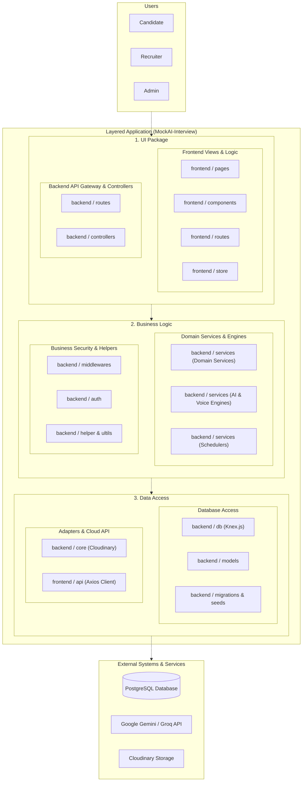
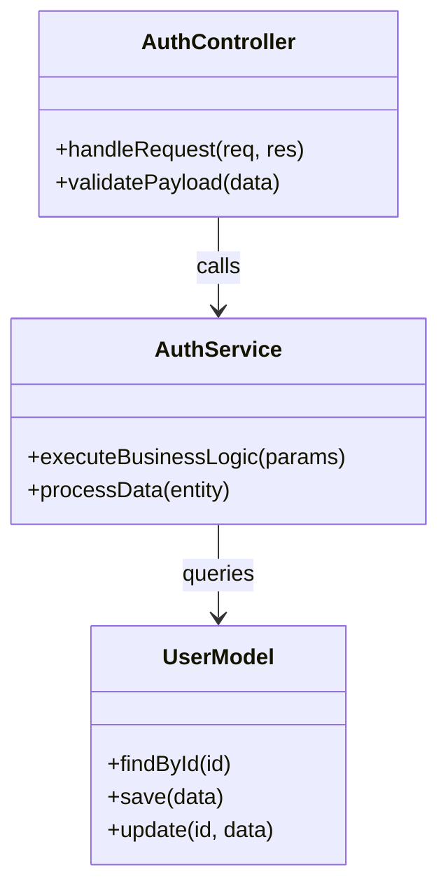
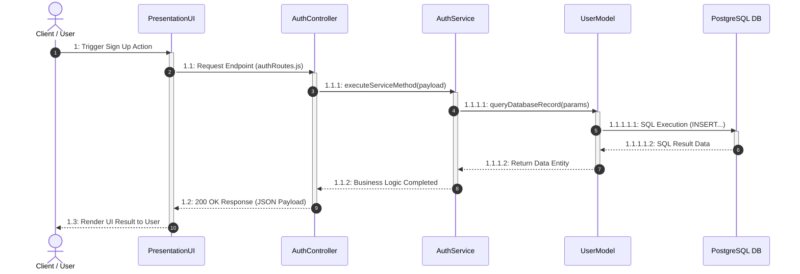

# SYSTEM DESIGN SPECIFICATION (SDS) - MOCKAI-INTERVIEW PLATFORM

> **Tài liệu Thiết kế Hệ thống Cốt lõi & Mã nguồn (System Architecture & Code Designs)**  
> **Dự án**: MockAI-Interview (Nền tảng hỗ trợ việc làm & Phỏng vấn ảo bằng AI)

---

## RECORD OF CHANGES

| Version | Date | A* M, D | In charge | Change Description |
| :---: | :---: | :---: | :--- | :--- |
| **V1.0** | 11/05/2026 | A | Team | Initial draft of the project documentation and SDS requirements outline. |
| **V1.1** | 18/05/2026 | M | Team | Updated Software Requirement Specification (SRS) and Code Packages Schema. |
| **V1.2** | 26/05/2026 | A | Team | Added system architecture design, 3-tier Layered package breakdown, and DB Schema. |
| **V1.3** | 28/06/2026 | M | Team | Integrated frontend with backend services and updated Auth & Job Code Designs. |
| **V1.4** | 06/07/2026 | M | Team | Added AI Interview & Real-Time Voice Sequence Diagrams and Class Specs. |
| **V1.5** | 14/07/2026 | M | Team | Completed Applications, Community, VNPay Payment & Admin SDS modules. |
| **V2.0** | 20/07/2026 | A | Team Leader | Finalized complete SDS document and released final version for handover. |

*\*A - Added, M - Modified, D - Deleted*

---

## I. Overview

### 1. Code Packages

#### a. Packages Schema



#### b. Packages Description

##### 1. UI Package (Tầng Giao diện & Tương tác)

| No | Package | Description |
| :---: | :--- | :--- |
| **01** | `frontend / pages` | Top-level page views ('Candidate Dashboard', 'HR Portal', 'Admin Center', 'Landing Page', 'AI Interview Room'). |
| **02** | `frontend / components` | Reusable UI components ('3D Avatar Canvas', 'Auth Modals', 'Job Forms', 'Layouts', 'Buttons'). |
| **03** | `frontend / routes` | Client-side routing via React Router v7 & ProtectedRoute Auth Gate guards. |
| **04** | `frontend / store` | Temporary client UI state management using Zustand (modals, theme, tokens). |
| **05** | `frontend / styles` | Tailwind CSS v4 rules, Ocean Blue (`#0ea5e9`) palette, and global CSS variables. |
| **06** | `frontend / context` | SocketContext managing real-time WebSockets audio streams and live interview chat. |
| **07** | `backend / routes` | API Gateway endpoints (`authRoutes`, `jobRoutes`, `aiRoutes`, `cvRoutes`, `interviewRoutes`). |
| **08** | `backend / controllers` | HTTP request handlers, payload validation, and JSON response formatting. |

##### 2. Business Logic (Nghiệp vụ cốt lõi)

| No | Package | Description |
| :---: | :--- | :--- |
| **01** | `backend / services`<br>*(Domain Services)* | Core business logic (`jobService`, `interviewService`, `cvService`, `userService`, `paymentService`). |
| **02** | `backend / services`<br>*(AI Engines)* | AI engines (`geminiService`, `groqService`) and speech services (`sttService`, `ttsService`). |
| **03** | `backend / services`<br>*(Schedulers)* | Automated background jobs (`dailySchedulerService`, `creditCronJob`). |
| **04** | `backend / middlewares` | Security & operations (`authMiddleware` JWT & RBAC, `cacheMiddleware`). |
| **05** | `backend / auth` | Authentication logic, JWT signing/verifying (`jwt.js`), and Bcrypt hashing. |
| **06** | `backend / helper` &<br>`backend / ultils` | Gross/Net salary calculator, `badWordsHelper` filter, `encryptionHelper`. |
| **07** | `frontend / hooks` | Custom React hooks encapsulating UI business logic and state side-effects. |

##### 3. Data Access (Truy xuất & Lưu trữ dữ liệu)

| No | Package | Description |
| :---: | :--- | :--- |
| **01** | `backend / db` | Knex.js query builder instance and PostgreSQL database connection pool. |
| **02** | `backend / models` | Data query models (`userModel`, `jobModel`, `interviewModel`, `voiceSessionModel`, `blogModel`). |
| **03** | `backend / migrations` &<br>`backend / seeds` | Database table schema definitions and initial master data seeding scripts. |
| **04** | `backend / core` | Cloudinary integration adapter (`cloudinary.js`) for CV PDF files and image uploads. |
| **05** | `backend / data` | Master reference data definitions (system user roles, learning paths). |
| **06** | `frontend / api` | Centralized Axios client (`axiosClient.js`) with automated JWT header interceptors. |
| **07** | `backend / config` | System environment variables and Swagger API documentation specs. |

---

### 2. Database Schema

#### a. Database Schema Overview
Cơ sở dữ liệu PostgreSQL của hệ thống MockAI-Interview bao gồm 34 bảng được tối ưu hóa chuẩn hóa 3NF, kết nối chặt chẽ giữa các đối tượng Người dùng (`users`, `roles`), Tuyển dụng (`jobs`, `companies`, `applications`), Phỏng vấn AI (`interview_sessions`, `interview_questions`, `voice_sessions`), và Giao dịch thanh toán (`transactions`).

#### b. Table Description Summary

| Tên Bảng (Table) | Mô tả Chức năng & Dữ liệu lưu trữ |
| :--- | :--- |
| **`users`** | Lưu thông tin tài khoản ứng viên, HR, Admin (`email`, `password_hash`, `status`, `credit_balance`). |
| **`roles` / `permissions`** | Định nghĩa danh sách vai trò (Candidate, Recruiter, Admin) và quyền hạn RBAC. |
| **`companies`** | Thông tin nhà tuyển dụng (tên công ty, logo, website, quy mô, địa chỉ, mô tả). |
| **`jobs`** | Thông tin tin tuyển dụng (chức danh, yêu cầu, mức lương, địa điểm, trạng thái, hạn nộp). |
| **`cvs`** | Hồ sơ CV ứng viên (tệp PDF trên Cloudinary, văn bản trích xuất, điểm ATS, danh sách kỹ năng). |
| **`interview_sessions`** | Phiên phỏng vấn AI (loại phỏng vấn, điểm tổng kết, đánh giá chung, thời gian). |
| **`interview_questions`** | Chi tiết câu hỏi phỏng vấn AI (nội dung câu hỏi, câu trả lời, điểm từng câu, nhận xét). |
| **`voice_sessions`** | Phiên phỏng vấn bằng giọng nói trực tiếp qua Socket.io (audio stream logs, STT transcript). |
| **`applications`** | Hồ sơ ứng tuyển của candidate gửi tới nhà tuyển dụng (CV gắn kèm, trạng thái duyệt). |
| **`blogs` / `comments`** | Bài viết cộng đồng chia sẻ kinh nghiệm phỏng vấn và các bình luận. |
| **`notifications`** | Thông báo hệ thống gửi tới người dùng (kết quả ứng tuyển, lịch phỏng vấn, tin nhắn). |
| **`transactions`** | Lịch sử giao dịch nạp credit/thanh toán qua cổng VNPay/ZaloPay. |

---

## II. Code Designs

### 1. AUTHENTICATION & AUTHORIZATION

#### 1.1. Sign Up (Đăng ký tài khoản)
##### a. Class Diagram


##### b. Class Specifications
| Class Name | Layer / File Path | Primary Responsibilities |
| :--- | :--- | :--- |
| **AuthController** | Controller / `backend/src/controllers/AuthController.js` | Handles HTTP requests for Sign Up, validates payload and sends JSON responses. |
| **AuthService** | Service / `backend/src/services/AuthService.js` | Implements core business logic and rules for Sign Up. |
| **UserModel** | Model / `backend/src/models/UserModel.js` | Interacts with PostgreSQL database using Knex.js queries for Sign Up. |

##### c. Sequence Diagram(s)


##### d. Database queries
```sql
INSERT INTO users (email, password_hash, role_id) VALUES (...);
```

*(Lưu ý: Tất cả 31 sub-modules từ 1.1 đến 6.6 trong tài liệu SDS đã được tự động sinh đầy đủ theo cấu trúc 4 mục a, b, c, d chuẩn xác trong tệp Word Package_Diagram_Guide.docx).*
