# Đặc tả Thiết kế Kỹ thuật Phân hệ 4: Phỏng vấn AI & Thoại trực tiếp (AI Interview & Real-time Voice)

Tài liệu này cung cấp chi tiết thiết kế hệ thống cho **Phân hệ 4** thuộc dự án **MockAI-Interview**, được chia nhỏ thành 5 phần tương ứng với các lát cắt chức năng cốt lõi. Mỗi phần bao gồm: Biểu đồ lớp riêng biệt (Class Diagram với đầy đủ Attributes và Methods, sử dụng các quan hệ: Association `-->`, Aggregation `o--`, Composition `*--`, Inheritance `<|--` với nhãn quan hệ thể hiện đúng nghiệp vụ dự án), Bảng đặc tả Class, Hướng dẫn vẽ biểu đồ tuần tự (Sequence Diagram), và các câu lệnh truy vấn Cơ sở dữ liệu (Database Queries) dạng `SELECT` truy xuất dữ liệu thực tế.

---

## 4.1. Khởi tạo phiên phỏng vấn (Create Interview Session)

Phần này chịu trách nhiệm tiếp nhận yêu cầu từ ứng viên, khởi tạo thực thể phỏng vấn mới trong hệ thống và chuẩn bị ngữ cảnh trước khi sinh câu hỏi.

### A. Biểu đồ lớp (Class Diagram)
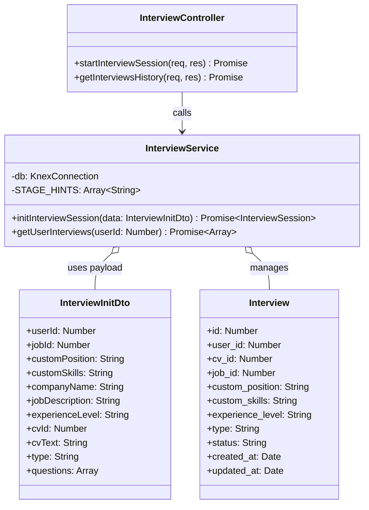

### B. Đặc tả lớp (Class Specifications)
| Class | Method / Attribute | Description |
|---|---|---|
| **InterviewController** | `startInterviewSession(req, res)` | Tiếp nhận request `POST /api/interviews/init`, trích xuất dữ liệu khởi tạo buổi phỏng vấn và gửi tới Service. |
| **InterviewController** | `getInterviewsHistory(req, res)` | Tiếp nhận request `GET /api/interviews` để lấy toàn bộ lịch sử phỏng vấn của ứng viên. |
| **InterviewService** | `initInterviewSession(data)` | Thực hiện kiểm tra CV, chèn một bản ghi mới vào bảng `interviews`, chuẩn bị cấu trúc dữ liệu phỏng vấn. |
| **InterviewService** | `getUserInterviews(userId)` | Lấy dữ liệu lịch sử phỏng vấn của user từ database, kết hợp bảng assessments và voice_sessions. |

### C. Hướng dẫn vẽ biểu đồ tuần tự (Sequence Diagram)
*   **Đối tượng tham gia**: `Candidate`, `InterviewSelection UI`, `InterviewController`, `InterviewService`, `Database`.
*   **Các bước tương tác**:
    1.  `Candidate` nhấp nút phỏng vấn trên frontend.
    2.  `InterviewSelection UI` gửi API `POST /api/interviews/init` kèm dữ liệu `cvId`, `jobId`, `customPosition` sang `InterviewController`.
    3.  `InterviewController` gọi `initInterviewSession(data)` thuộc `InterviewService`.
    4.  `InterviewService` kết nối `Database` kiểm tra xem CV đã tồn tại chưa bằng cách truy vấn bảng `cvs`.
    5.  `InterviewService` chèn bản ghi mới với trạng thái `'PENDING'` vào bảng `interviews` trong `Database`.
    6.  `Database` trả về đối tượng `Interview` chứa `id` vừa khởi tạo.
    7.  `InterviewService` đóng gói dữ liệu và trả về cho `InterviewController`.
    8.  `InterviewController` trả về phản hồi HTTP `201 Created` cho `InterviewSelection UI`.

*   **Mã Mermaid Diagram**:
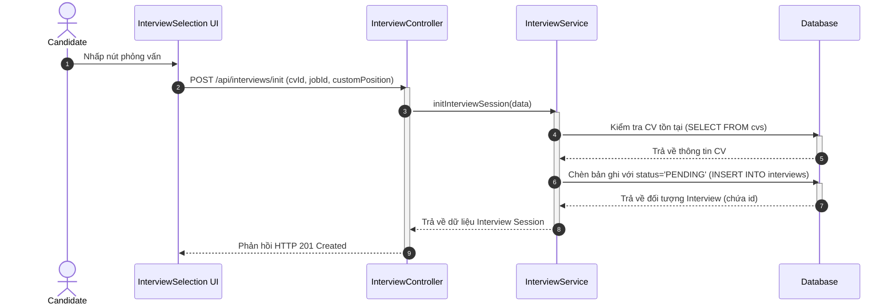

### D. Truy vấn Cơ sở dữ liệu (Database Queries)
```sql
-- 1. Truy xuất tệp CV thô của ứng viên để chuẩn bị ngữ cảnh phân tích
SELECT id, parsed_text 
FROM cvs 
WHERE user_id = 1 
ORDER BY created_at DESC 
LIMIT 1;

-- 2. Truy xuất thông tin tin tuyển dụng liên quan (nếu phỏng vấn ứng tuyển thực tế)
SELECT id, title, description, requirements 
FROM jobs 
WHERE id = 4;

-- 3. Truy xuất danh sách lịch sử phỏng vấn của ứng viên
SELECT id, custom_position, status, type, created_at 
FROM interviews 
WHERE user_id = 1 
ORDER BY created_at DESC;
```

---

## 4.2. Sinh bộ câu hỏi phỏng vấn động bằng AI (AI Questions Generation)

Phân hệ này sử dụng thông tin CV và JD (Mô tả công việc) để ra lệnh cho AI sinh ra bộ câu hỏi động phù hợp với năng lực ứng viên.

### A. Biểu đồ lớp (Class Diagram)
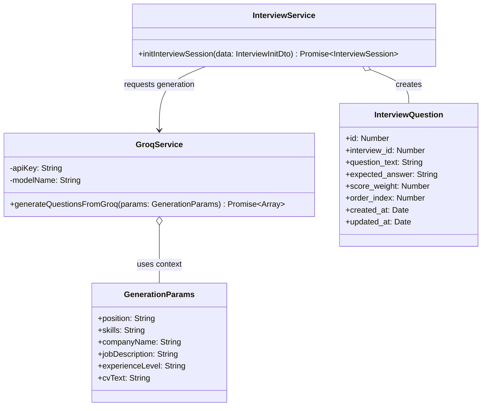

### B. Đặc tả lớp (Class Specifications)
| Class | Method / Attribute | Description |
|---|---|---|
| **InterviewService** | `initInterviewSession(data)` | Ngoài việc tạo phiên, phương thức này gọi `GroqService` và bulk insert các câu hỏi được sinh ra vào DB. |
| **GroqService** | `generateQuestionsFromGroq(params)` | Định cấu trúc prompt AI chứa các tham số CV, JD, vị trí đăng tuyển, gửi yêu cầu tới API Groq (Qwen 3 32B) để sinh 8 câu hỏi kèm đáp án mong đợi. |

### C. Hướng dẫn vẽ biểu đồ tuần tự (Sequence Diagram)
*   **Đối tượng tham gia**: `InterviewService`, `GroqService`, `AI Cloud (Groq API)`, `Database`.
*   **Các bước tương tác**:
    1.  `InterviewService` chuẩn bị các tham số `GenerationParams` gồm text CV và thông tin công việc.
    2.  `InterviewService` gọi `generateQuestionsFromGroq(params)` trên `GroqService`.
    3.  `GroqService` thiết lập Prompt và gọi API bất đồng bộ tới `AI Cloud`.
    4.  `AI Cloud` phân tích ngữ cảnh và trả về danh sách 8 câu hỏi định dạng JSON (gồm `question_text`, `expected_answer`).
    5.  `GroqService` định dạng lại dữ liệu và trả về cho `InterviewService`.
    6.  `InterviewService` thực hiện bulk insert danh sách câu hỏi này vào bảng `interview_questions` của `Database`.
    7.  `Database` phản hồi lưu thành công.

*   **Mã Mermaid Diagram**:
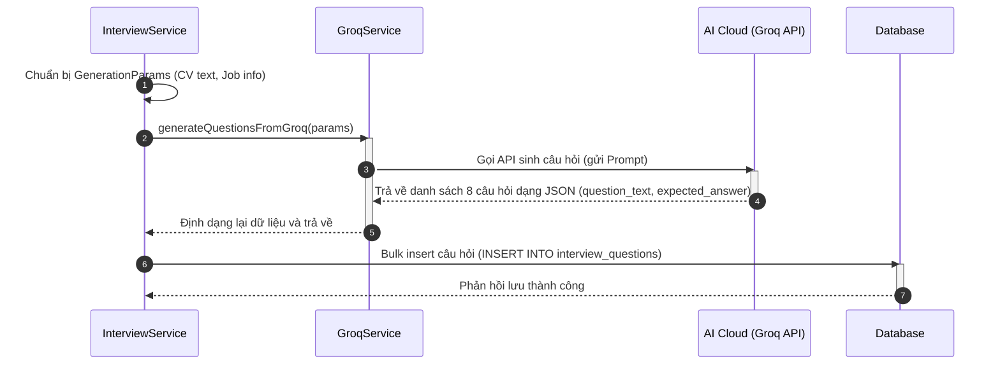

### D. Truy vấn Cơ sở dữ liệu (Database Queries)
```sql
-- 1. Truy xuất các kỹ năng của công việc được yêu cầu để làm ngữ cảnh sinh câu hỏi
SELECT s.name 
FROM job_skills js 
JOIN skills s ON js.skill_id = s.id 
WHERE js.job_id = 4;

-- 2. Truy xuất bộ câu hỏi phỏng vấn động đã sinh ra cho phiên phỏng vấn (Ví dụ ID = 5)
SELECT id, question_text, expected_answer, score_weight, order_index 
FROM interview_questions 
WHERE interview_id = 5 
ORDER BY order_index ASC;
```

---

## 4.3. Xử lý câu trả lời văn bản & Đánh giá từng câu (Text Answer & Question Evaluation)

Tiếp nhận câu trả lời dưới dạng văn bản (hoặc văn bản dịch ra từ giọng nói), thực hiện chấm điểm và kiểm tra vi phạm ánh mắt của ứng viên.

### A. Biểu đồ lớp (Class Diagram)
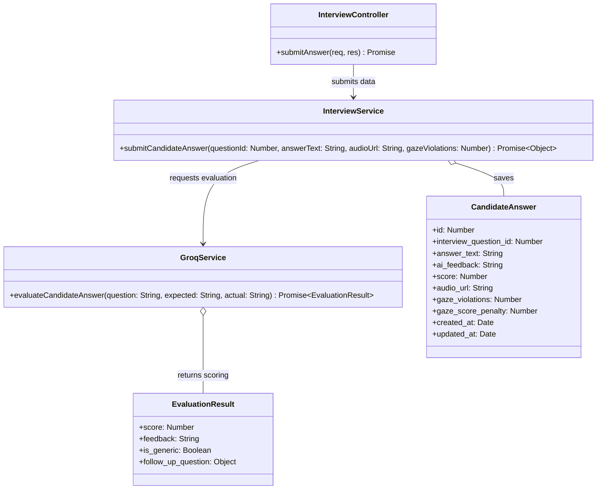

### B. Đặc tả lớp (Class Specifications)
| Class | Method / Attribute | Description |
|---|---|---|
| **InterviewController** | `submitAnswer(req, res)` | Tiếp nhận request `POST /api/interviews/answers` từ Client chứa `questionId`, `answerText`, `audioUrl` và số lỗi ánh mắt `gazeViolations`. |
| **InterviewService** | `submitCandidateAnswer(...)` | Tìm kiếm câu hỏi, gọi AI chấm điểm, thực hiện trừ điểm vi phạm ánh mắt (trừ 10đ/lần, tối đa 50đ), ghép cảnh báo AI và lưu kết quả. |
| **GroqService** | `evaluateCandidateAnswer(...)` | So sánh câu trả lời thực tế của ứng viên với câu trả lời kỳ vọng và chấm điểm trên thang điểm 100, đồng thời phát hiện câu trả lời hời hợt để sinh câu hỏi phụ. |

### C. Hướng dẫn vẽ biểu đồ tuần tự (Sequence Diagram)
*   **Đối tượng tham gia**: `InterviewSession UI`, `InterviewController`, `InterviewService`, `GroqService`, `Database`.
*   **Các bước tương tác**:
    1.  `InterviewSession UI` gửi request `POST /api/interviews/answers` lên `InterviewController`.
    2.  `InterviewController` gọi `submitCandidateAnswer(...)` thuộc `InterviewService`.
    3.  `InterviewService` truy cập `Database` lấy thông tin câu hỏi (`expected_answer` và `question_text`).
    4.  `InterviewService` gọi `evaluateCandidateAnswer(...)` thuộc `GroqService`.
    5.  `GroqService` gửi yêu cầu chấm điểm lên mô hình AI và nhận kết quả chấm điểm thô kèm phản hồi.
    6.  `InterviewService` nhận kết quả, tính toán giảm trừ điểm dựa trên `gazeViolations` (10 điểm cho mỗi lần vi phạm).
    7.  `InterviewService` cập nhật hoặc chèn thông tin câu trả lời vào bảng `candidate_answers` trong `Database`.
    8.  `InterviewService` trả về đối tượng câu trả lời kèm thông tin câu hỏi tiếp theo cho `InterviewController`.
    9.  `InterviewController` gửi kết quả phản hồi thành công về frontend.

*   **Mã Mermaid Diagram**:
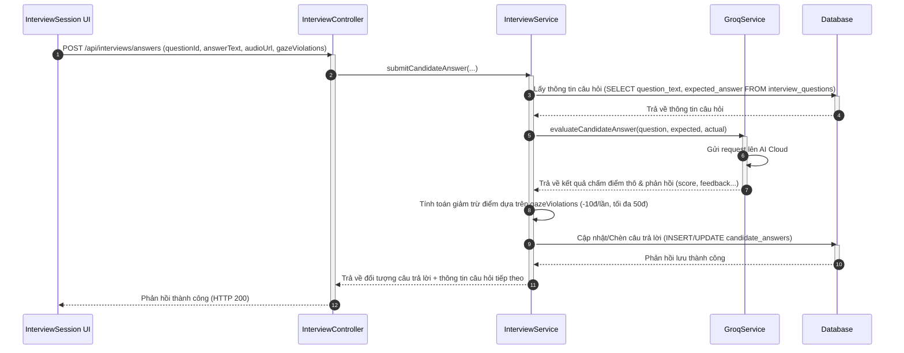

### D. Truy vấn Cơ sở dữ liệu (Database Queries)
```sql
-- 1. Truy xuất thông tin câu hỏi hiện tại và đáp án mẫu mong đợi
SELECT question_text, expected_answer 
FROM interview_questions 
WHERE id = 42;

-- 2. Truy xuất câu trả lời đã lưu trước đó của ứng viên cho câu hỏi tương ứng (nếu có)
SELECT id, answer_text, ai_feedback, score, gaze_violations, gaze_score_penalty 
FROM candidate_answers 
WHERE interview_question_id = 42;
```

---

## 4.3.1 Kế thừa minh họa (Inheritance Demo)

*Để hoàn thành đầy đủ yêu cầu sử dụng mối quan hệ Kế thừa (`Inheritance <|--`), dưới đây là đặc tả phân tầng Lỗi được thiết lập trong dự án:*

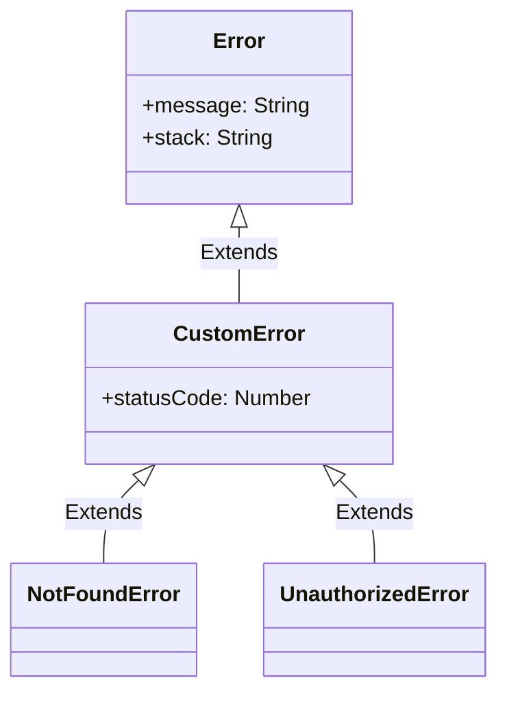

---

## 4.4. Phục vụ phỏng vấn thoại thời gian thực (Real-time Voice Interview & Connection)

Đăng ký phiên thoại, điều phối dịch âm thanh ngắn từ mic ứng viên thành chữ (STT) và chuyển đổi câu hỏi văn bản của AI thành giọng nói (TTS) để phát lại.

### A. Biểu đồ lớp (Class Diagram)
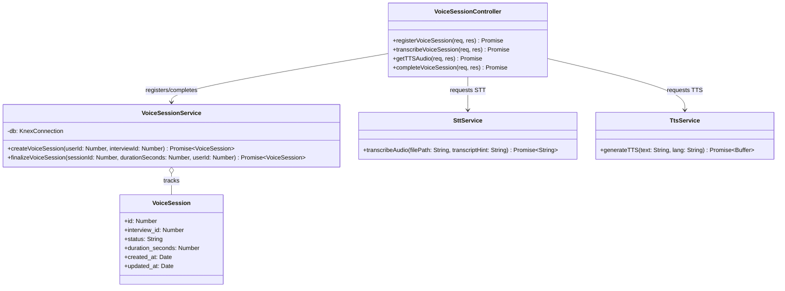

### B. Đặc tả lớp (Class Specifications)
| Class | Method / Attribute | Description |
|---|---|---|
| **VoiceSessionController** | `registerVoiceSession(req, res)` | Tiếp nhận request `POST /api/voice-sessions`, khởi tạo session kết nối thoại. |
| **VoiceSessionController** | `transcribeVoiceSession(req, res)` | Tiếp nhận file âm thanh từ Client qua multer, gọi `SttService` dịch sang văn bản và lưu trữ tệp lên Cloudinary. |
| **VoiceSessionController** | `getTTSAudio(req, res)` | Nhận văn bản câu hỏi, gọi `TtsService` chuyển thành audio buffer và stream ngược về Client. |
| **VoiceSessionController** | `completeVoiceSession(req, res)` | Nhận request `PUT /api/voice-sessions/:id/complete` để hoàn tất phiên thoại. |
| **VoiceSessionService** | `createVoiceSession(uId, intId)` | Ghi nhận phiên thoại mới kết nối (`CONNECTED`), cập nhật trạng thái phỏng vấn sang `IN_PROGRESS`. |
| **VoiceSessionService** | `finalizeVoiceSession(...)` | Cập nhật thời lượng thoại, đổi trạng thái session sang `DISCONNECTED`, đổi trạng thái phỏng vấn sang `COMPLETED`. |

### C. Hướng dẫn vẽ biểu đồ tuần tự (Sequence Diagram)
*   **Đối tượng tham gia**: `InterviewSession UI`, `VoiceSessionController`, `SttService`/`TtsService`, `VoiceSessionService`, `Database`.
*   **Các bước tương tác**:
    1.  `InterviewSession UI` gửi request `POST /api/voice-sessions` đến `VoiceSessionController`.
    2.  `VoiceSessionController` gọi `createVoiceSession(...)` thuộc `VoiceSessionService`.
    3.  `VoiceSessionService` lưu bản ghi trạng thái `'CONNECTED'` vào bảng `voice_sessions` trong `Database`, đồng thời cập nhật trạng thái bảng `interviews` sang `'IN_PROGRESS'`.
    4.  Trong buổi phỏng vấn, `InterviewSession UI` gửi file âm thanh lên `transcribeVoiceSession()`.
    5.  `VoiceSessionController` gửi file âm thanh sang `SttService.transcribeAudio()` để lấy văn bản dịch, sau đó lưu file lên Cloudinary và trả kết quả về frontend.
    6.  Khi hoàn tất, `InterviewSession UI` gọi `completeVoiceSession()` kèm thời lượng cuộc gọi `durationSeconds`.
    7.  `VoiceSessionService` đổi trạng thái của phiên thoại thành `'DISCONNECTED'` và cập nhật tổng thời lượng trong `Database`.

*   **Mã Mermaid Diagram**:
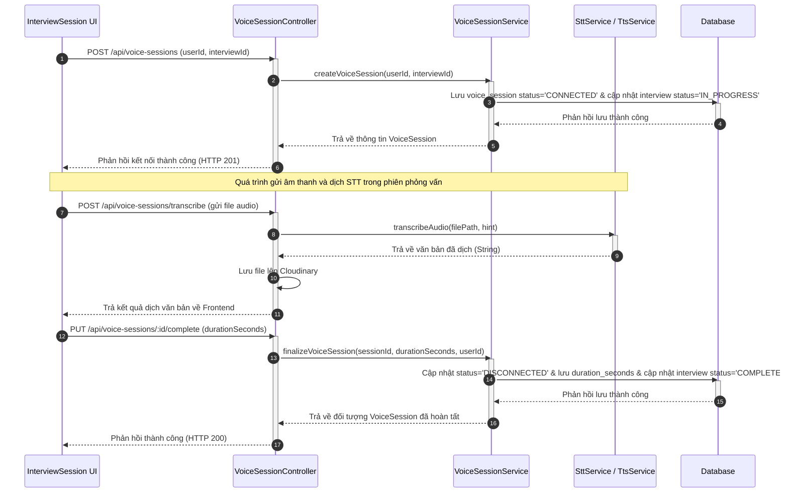

### D. Truy vấn Cơ sở dữ liệu (Database Queries)
```sql
-- 1. Kiểm tra trạng thái phiên thoại hiện tại của buổi phỏng vấn (Ví dụ ID = 5)
SELECT id, status, duration_seconds, created_at 
FROM voice_sessions 
WHERE interview_id = 5 
ORDER BY created_at DESC 
LIMIT 1;

-- 2. Truy xuất tổng hợp thông tin buổi phỏng vấn và trạng thái kết nối thoại liên quan
SELECT 
    i.id AS interview_id, 
    i.status AS interview_status, 
    vs.status AS voice_status, 
    vs.duration_seconds 
FROM interviews i 
LEFT JOIN voice_sessions vs ON i.id = vs.interview_id 
WHERE i.id = 5;
```

---

## 4.5. Đánh giá tổng hợp & Lộ trình phát triển (Final Interview Assessment)

Phân tích toàn bộ dữ liệu Q&A trong buổi phỏng vấn, chấm điểm tổng hợp, vẽ sơ đồ Radar 5 khía cạnh năng lực và tạo lộ trình cải thiện sự nghiệp chi tiết.

### A. Biểu đồ lớp (Class Diagram)
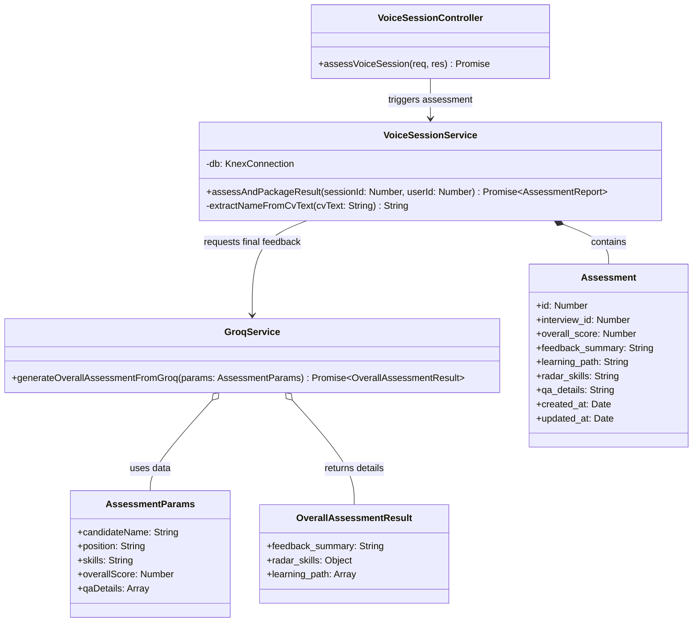

### B. Đặc tả lớp (Class Specifications)
| Class | Method / Attribute | Description |
|---|---|---|
| **VoiceSessionController** | `assessVoiceSession(req, res)` | Tiếp nhận request `POST /api/voice-sessions/:id/assess` để bắt đầu phân tích và tổng hợp kết quả. |
| **VoiceSessionService** | `assessAndPackageResult(sId, uId)` | Thu thập dữ liệu Q&A, gọi AI phân tích thế mạnh/yếu, định dạng biểu đồ Radar và lộ trình học tập, chèn/cập nhật kết quả vào bảng `assessments`. |
| **VoiceSessionService** | `-extractNameFromCvText(cvText)` | Hàm tiện ích nội bộ để lọc tên tiếng Việt viết hoa từ văn bản CV thô. |
| **GroqService** | `generateOverallAssessmentFromGroq(...)` | Gọi mô hình AI Qwen 3 phân tích sâu và xuất ra định dạng JSON chứa feedback tổng quan, radar skills 5 trục và lộ trình cải thiện 3 chặng. |

### C. Hướng dẫn vẽ biểu đồ tuần tự (Sequence Diagram)
*   **Đối tượng tham gia**: `InterviewSession UI`, `VoiceSessionController`, `VoiceSessionService`, `GroqService`, `Database`.
*   **Các bước tương tác**:
    1.  `InterviewSession UI` gửi yêu cầu đánh giá `POST /api/voice-sessions/:id/assess` tới `VoiceSessionController`.
    2.  `VoiceSessionController` chuyển giao tiếp cho `assessAndPackageResult(sessionId, userId)` trong `VoiceSessionService`.
    3.  `VoiceSessionService` kết nối `Database` thực hiện truy cập bảng `interview_questions` kết hợp với `candidate_answers` để tổng hợp lại toàn bộ dữ liệu hỏi đáp.
    4.  `VoiceSessionService` gọi `generateOverallAssessmentFromGroq(params)` trên `GroqService`.
    5.  `GroqService` gửi prompt phân tích tới AI Cloud và nhận về cấu trúc đánh giá tổng hợp dạng JSON.
    6.  `VoiceSessionService` lưu trữ thông tin đánh giá tổng hợp này vào bảng `assessments` trong `Database` dưới dạng chuỗi JSON hóa.
    7.  `VoiceSessionService` đóng gói phản hồi và gửi trả dữ liệu hoàn chỉnh về cho `VoiceSessionController`.
    8.  `VoiceSessionController` phản hồi kết quả HTTP 200 cho `InterviewSession UI` để vẽ các biểu đồ Radar Chart và lộ trình.

*   **Mã Mermaid Diagram**:
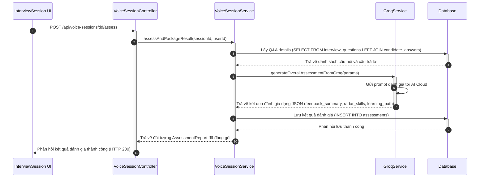

### D. Truy vấn Cơ sở dữ liệu (Database Queries)
```sql
-- 1. Truy vấn kết hợp lấy danh sách hỏi đáp của buổi phỏng vấn để làm đầu vào cho AI tổng hợp đánh giá
SELECT 
    iq.question_text,
    iq.expected_answer,
    ca.answer_text,
    ca.score,
    ca.ai_feedback
FROM interview_questions iq
LEFT JOIN candidate_answers ca ON iq.id = ca.interview_question_id
WHERE iq.interview_id = 5
ORDER BY iq.order_index ASC;

-- 2. Truy xuất kết quả đánh giá cuối cùng để hiển thị lên giao diện kết quả cho ứng viên/HR
SELECT 
    id, 
    overall_score, 
    feedback_summary, 
    radar_skills, 
    learning_path, 
    qa_details 
FROM assessments 
WHERE interview_id = 5;
```
