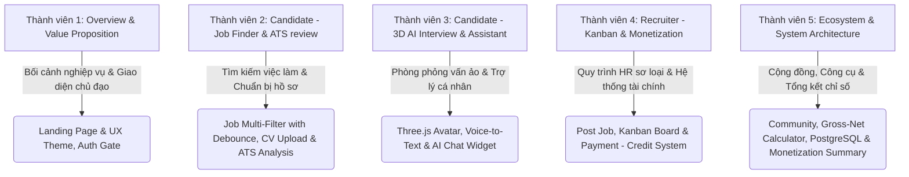

# Kịch bản Thuyết trình Demo Hệ thống MockAI-Interview

> **Tài liệu hướng dẫn thuyết trình kết hợp Demo trực tiếp (Không sử dụng Slides)**
> **Đối tượng thính giả**: Thạc sĩ Quản lý Hệ thống Thông tin / Business Analyst (BA) / Hội đồng Đánh giá Dự án
> **Mục tiêu**: Làm nổi bật kiến trúc nghiệp vụ (Business Architecture), các luồng xử lý end-to-end, định hướng sản phẩm dựa trên tâm lý người dùng (UX Psychology-driven) và cách hệ sinh thái AI giải quyết nỗi đau của cả Ứng viên & Nhà tuyển dụng.
> **Thời lượng khuyến nghị**: 20 - 25 phút (4-5 phút/thành viên).

---

## TỔNG QUAN PHÂN CHIA THÀNH VIÊN VÀ NHIỆM VỤ DEMO

---

## PHẦN 1: BỐI CẢNH NGHIỆP VỤ, GIAO DIỆN CHỦ ĐẠO & AUTH GATE PROTOCOL
**Trình bày: Thành viên 1**
**Thời lượng**: 4 phút
**Trọng tâm BA & UX**: Xác định các Pain points của thị trường, ngôn ngữ thiết kế nhất quán (Design System) và nguyên lý bảo vệ trải nghiệm người dùng (Auth Gate).

### Lời thoại thuyết trình (Kịch bản nói)
"Kính chào Hội đồng và các bạn. Là các Business Analyst, chúng ta đều nhận thấy quy trình tuyển dụng truyền thống đang gặp phải những thách thức lớn:
1. **Đối với Ứng viên (Candidate)**: Thiếu công cụ tự đánh giá hồ sơ chuẩn ATS (Applicant Tracking System), dẫn đến tỷ lệ CV bị loại tự động cao. Đồng thời, họ thiếu cơ hội thực chiến phỏng vấn dẫn đến tâm lý lo sợ trước buổi phỏng vấn thật.
2. **Đối với Nhà tuyển dụng (HR)**: Tiêu tốn trung bình **23 giờ** để lọc hồ sơ cho mỗi vị trí và đối mặt với rủi ro tuyển sai người (Bad hire) gây tổn hại chi phí tài chính tương đương **30% mức lương năm** của nhân sự đó.

Đó là lý do chúng tôi xây dựng **MockAI-Interview** - Nền tảng hỗ trợ việc làm toàn diện tích hợp Trí tuệ nhân tạo (AI) cao cấp. Hệ thống được thiết kế đồng bộ với gam màu chủ đạo là **Ocean Blue (Xanh đại dương: Primary `#0ea5e9`, Secondary `#38bdf8`)** biểu trưng cho sự tin cậy, chuyên nghiệp và hơi thở công nghệ. Toàn bộ giao diện được căn chỉnh theo **lưới 8-point grid** chuẩn UI/UX, mang lại cấu trúc cân đối và những chuyển động micro-animations (Framer Motion, GSAP) mượt mà làm tăng tối đa sự hài lòng khi trải nghiệm."

### Kịch bản thao tác Demo trên Web
1. **Thao tác 1 (Landing Page)**: Đứng tại **Landing Page** của MockAI-Interview. Cuộn chuột mượt mà để hội đồng thấy các phần giới thiệu tính năng chính (ATS Scoring, 3D AI Interview, Job Board). 
   - *Điểm nhấn UX*: Chỉ vào phối màu Ocean Blue, các nút CTA thiết kế bo góc mềm mại, đổ bóng đa tầng (layered shadows) tạo cảm giác cực kỳ sang trọng, cao cấp.
2. **Thao tác 2 (Auth Gate Protocol)**: Rê chuột lên thanh điều hướng (Navbar) và chỉ vào các mục **Jobs**, **Community**, **Tools**.
   - *BA/UX Point*: Thực hiện click vào mục **Jobs** khi chưa đăng nhập.
   - *Giải thích*: *"Chúng tôi áp dụng giao thức **Auth Gate** rất tinh tế. Khi người dùng chưa đăng nhập cố tình truy cập vào các trang nội bộ, hệ thống sẽ **chặn chuyển trang** và ngay lập tức hiển thị một Toast Notification ở góc phải màn hình thông báo: 'Yêu cầu đăng nhập để dùng được tính năng này'. Chúng tôi **không tự động mở Auth Modal** thô bạo, tôn trọng hoàn toàn quyền kiểm soát của người dùng, giúp hạn chế tỷ lệ thoát trang do ức chế (bounce rate)."*
3. **Thao tác 3**: Click nút **Đăng nhập** trên Navbar, nhập tài khoản Candidate demo để đăng nhập. Giao diện trang cá nhân chuyển hướng mượt mà. Bàn giao mic cho Thành viên 2.

---

## PHẦN 2: CANDIDATE FLOW - TÌM KIẾM VIỆC LÀM ĐA CHIỀU & TỐI ƯU HỒ SƠ ATS
**Trình bày: Thành viên 2**
**Thời lượng**: 4 phút
**Trọng tâm BA & UX**: Quy trình tìm kiếm tối ưu hóa hiệu năng bằng kỹ thuật Debounced Search, bộ lọc đa chiều giống TopCV, và thuật toán chấm điểm độ tương thích CV (ATS Matcher).

### Lời thoại thuyết trình (Kịch bản nói)
"Cảm ơn Thành viên 1. Sau khi ứng viên đăng nhập thành công, hệ thống mở ra hành trình tìm việc và tối ưu hóa năng lực bản thân.
Đầu tiên là trang **Jobs** ([Jobs.jsx](file:///c:/Users/ADMIN/Desktop/SWP/MockAI-Interview/frontend/src/pages/candidate/Jobs.jsx)). Để giúp ứng viên nhanh chóng tìm thấy cơ hội phù hợp nhất, chúng tôi thiết kế **Bộ lọc việc làm đa chiều thông minh (Smart Multi-Filter)** ở phía trên giao diện. Bộ lọc này cho phép lọc theo: Ngành nghề, Mức lương, Kinh nghiệm, Cấp bậc, Hình thức làm việc, Giới tính và Địa điểm.
Đặc biệt, để tối ưu hóa tài nguyên server và tránh hiện tượng giật lag khi người dùng gõ tìm kiếm, chúng tôi cài đặt cơ chế **Debounced Search (400ms)**. Khi ứng viên nhập từ khóa, hệ thống sẽ đợi họ dừng gõ 400ms mới kích hoạt API gửi request lên database. Điều này giúp giảm tới **80% số lượng request dư thừa** lên backend, giúp hệ thống hoạt động vô cùng nhẹ nhàng.

Khi đã chọn được công việc mong muốn, ứng viên có thể tự đánh giá hồ sơ của mình bằng tính năng **CV Review** ([CVReview.jsx](file:///c:/Users/ADMIN/Desktop/SWP/MockAI-Interview/frontend/src/pages/candidate/CVReview.jsx)). AI Parser sẽ trích xuất dữ liệu từ CV PDF và so khớp với bản mô tả công việc (JD) để đưa ra điểm số tương thích ATS."

### Kịch bản thao tác Demo trên Web
1. **Thao tác 1 (Jobs Board & Filter)**: Click vào trang **Jobs** trên Navbar.
   - Thử gõ nhanh từ khóa `React JS` vào ô Tìm kiếm. Giải thích về độ trễ debounce 400ms (giúp danh sách cập nhật mượt mà, không bị giật).
   - Click chọn nhanh bộ lọc địa điểm `Hồ Chí Minh`, mức lương `Thỏa thuận` và kinh nghiệm `1-2 năm` trên thanh bộ lọc ngang thiết kế gọn gàng.
2. **Thao tác 2 (CV Review & ATS)**: Click chọn mục **CV Review** trên sidebar.
   - Click nút tải lên CV, chọn một file CV PDF demo (ví dụ: `CV_Frontend_Developer.pdf`).
   - Hệ thống hiển thị hiệu ứng Loading mượt mà trong khi AI phân tích cấu trúc dữ liệu PDF.
3. **Thao tác 3 (Kết quả ATS)**: Show kết quả điểm ATS trên màn hình (ví dụ: **75%**).
   - Chỉ vào bảng so sánh kỹ năng bị thiếu hụt: *"Hệ thống cảnh báo CV của tôi đang thiếu các từ khóa thiết yếu như 'Zustand' và 'PostgreSQL'. AI cũng lập tức đưa ra gợi ý viết lại phần mô tả dự án để tích hợp các kỹ năng này."* Bàn giao mic cho Thành viên 3.

---

## PHẦN 3: CANDIDATE FLOW - PHÒNG PHỎNG VẤN ẢO AI 3D & TRỢ LÝ CHAT BOX AI ĐỒNG HÀNH
**Trình bày: Thành viên 3**
**Thời lượng**: 5 phút
**Trọng tâm BA & UX**: Công nghệ tương tác thời gian thực (Voice-to-Text) kết hợp mô hình 3D (Three.js), và sự hỗ trợ toàn diện của Chat Box AI cá nhân hóa.

### Lời thoại thuyết trình (Kịch bản nói)
"Cảm ơn Thành viên 2. Khi CV đã được tối ưu hóa, ứng viên sẽ bước vào giai đoạn quan trọng nhất: Luyện tập phỏng vấn ảo.
Tại MockAI-Interview, chúng tôi phát triển **Phòng phỏng vấn ảo AI 3D Real-time** ([HRInterviewRoom.jsx](file:///c:/Users/ADMIN/Desktop/SWP/MockAI-Interview/frontend/src/pages/candidate/HRInterviewRoom.jsx)). Chúng tôi **không sử dụng ngân hàng câu hỏi cố định** để tránh sự nhàm chán. AI sẽ tự động đọc hiểu CV + JD cụ thể để cá nhân hóa hoàn toàn bộ câu hỏi.
Đồng thời, để tăng cường trải nghiệm tương tác tự nhiên, ở góc dưới bên phải màn hình luôn có sự xuất hiện của **AI Chat Widget** ([AIChatWidget.jsx](file:///c:/Users/ADMIN/Desktop/SWP/MockAI-Interview/frontend/src/components/ai/AIChatWidget.jsx)). Đây là trợ lý ảo đồng hành 24/7 giúp giải đáp nhanh các thắc mắc về kỹ năng, tư vấn lộ trình học tập và hướng dẫn sử dụng tính năng của hệ thống dưới định dạng Markdown trực quan."

### Kịch bản thao tác Demo trên Web
1. **Thao tác 1 (AI Chat Widget)**: Click vào icon bong bóng chat màu Ocean Blue ở góc dưới cùng bên phải màn hình để mở **AI Chat Widget**.
   - Nhập một câu hỏi nhanh: *"Tôi nên chuẩn bị kiến thức gì trước khi phỏng vấn vị trí Web Developer với AI?"*
   - Chỉ vào giao diện chat: Trả lời dạng Markdown rõ ràng, có phân tích Bullet Points chuyên nghiệp. Có thể click nút Phóng to (Maximize) để đọc dễ hơn hoặc Thu nhỏ (Minimize) để tiếp tục thao tác khác.
2. **Thao tác 2 (AI Interview Room)**: Click vào **Interview Prep**, chọn vị trí phỏng vấn Web Developer và file CV vừa phân tích. Bấm **Bắt đầu phỏng vấn**.
3. **Thao tác 3 (Voice Demo)**: Giao diện phòng phỏng vấn 3D hiện ra với mô hình người phỏng vấn ảo được dựng bằng Three.js sống động.
   - Nhấn biểu tượng Microphone, giả lập trả lời câu hỏi: *"I have experienced working with React and state management libraries like Zustand for 2 years."*
   - Chỉ vào phần văn bản được chuyển đổi tức thì từ giọng nói sang chữ viết (Voice-to-Text) trên màn hình nhờ Web Speech API. Bấm nút Gửi câu trả lời.
4. **Thao tác 4 (Kết quả phỏng vấn)**: Nhấn **Kết thúc phỏng vấn sớm** để chuyển đến trang kết quả ([HRInterviewResult.jsx](file:///c:/Users/ADMIN/Desktop/SWP/MockAI-Interview/frontend/src/pages/candidate/HRInterviewResult.jsx)).
   - Chỉ vào **Radar Chart 5 yếu tố năng lực** (Chuyên môn, Giao tiếp, Tự tin, Giải quyết vấn đề, Sự chuẩn bị).
   - Chỉ vào nhận xét chi tiết và gợi ý câu trả lời mẫu (Sample Answers). Bàn giao mic cho Thành viên 4.

---

## PHẦN 4: RECRUITER FLOW - KANBAN SHORTLIST BOARD & HỆ THỐNG THANH TOÁN PAYMENT
**Trình bày: Thành viên 4**
**Thời lượng**: 4 phút
**Trọng tâm BA**: Nghiệp vụ quản lý quy trình ứng tuyển (BPM) dạng Kanban, và Mô hình tài chính kép (Dual-Monetization Model) thông qua hệ thống nạp Credit & mua Gói dịch vụ.

### Lời thoại thuyết trình (Kịch bản nói)
"Cảm ơn Thành viên 3. Chúng ta đã đi qua trải nghiệm của ứng viên. Bây giờ, hãy đứng dưới góc nhìn của doanh nghiệp tuyển dụng.
Chúng tôi cung cấp cho Recruiter một **Kanban Shortlist Board** trực quan ([ShortlistBoard.jsx](file:///c:/Users/ADMIN/Desktop/SWP/MockAI-Interview/frontend/src/pages/recruiter/ShortlistBoard.jsx)) giúp phân loại ứng viên theo thời gian thực (Real-time syncing qua Socket.io).
Đồng thời, để vận hành mô hình kinh doanh bền vững, MockAI-Interview thiết kế **Hệ thống nạp Credit & Quản lý gói dịch vụ (Payment & Credit Manager)** ([Payment.jsx](file:///c:/Users/ADMIN/Desktop/SWP/MockAI-Interview/frontend/src/pages/shared/Payment.jsx)) tích hợp VNPay và Momo. Chúng tôi áp dụng **mô hình doanh thu kép (Dual-Monetization)**:
- **Ứng viên (Candidate)**: Đăng ký các gói dịch vụ Pro theo tháng/năm để có thêm lượt ATS và Luyện phỏng vấn AI nâng cao.
- **Doanh nghiệp (Recruiter)**: Sử dụng phương thức **Pay-As-You-Go** cực kỳ linh hoạt. HR nạp tiền mua **Credit** và chi trả cho từng hành động cụ thể: Đăng tin tuyển dụng (10 credits), Kích hoạt tính năng tự động lọc AI Screening (30 credits) để AI tự chấm điểm hồ sơ, và chạy phỏng vấn ảo AI cho ứng viên (10 credits/lượt). Điều này giúp doanh nghiệp tối ưu chi phí tuyển dụng theo nhu cầu thực tế."

### Kịch bản thao tác Demo trên Web
1. **Thao tác 1 (HR Dashboard & Kanban)**: Đăng xuất Candidate, đăng nhập nhanh bằng tài khoản Recruiter đã lưu sẵn.
   - Vào mục **Shortlist Board** trên Sidebar. Thực hiện kéo thả thẻ ứng viên Nguyễn Văn A từ cột *Applied* sang *AI Interviewed*.
   - *Giải thích*: *"Hành động kéo thả này kích hoạt Socket.io cập nhật trạng thái tuyển dụng tức thì ở trang Candidate và gửi email thông báo tự động."*
   - Click vào thẻ ứng viên Nguyễn Văn A để xem nhanh điểm ATS và kết quả phỏng vấn thử của họ với AI mà không cần tổ chức phỏng vấn sơ loại thủ công.
2. **Thao tác 2 (Payment Page)**: Click vào mục **Pricing / Payment** trên Navbar hoặc Settings ([Payment.jsx](file:///c:/Users/ADMIN/Desktop/SWP/MockAI-Interview/frontend/src/pages/shared/Payment.jsx)).
   - Chỉ vào giao diện trang thanh toán: Thiết kế cấu trúc phân chia rõ ràng 2 Tab: *Candidate Packages* và *Recruiter Credits*.
   - Chỉ vào các gói giá và bảng giá credit hành động (10 credit cho đăng tin, 30 credit lọc AI...).
   - Show nhanh nút nạp tiền qua VNPay/Momo đã được thiết kế sẵn sàng cho việc mở rộng thanh toán thực tế. Bàn giao mic cho Thành viên 5.

---

## PHẦN 5: HỆ SINH THÁI BỔ TRỢ, KIẾN TRÚC HỆ THỐNG & TỔNG KẾT MÔ HÌNH NGHIỆP VỤ BA
**Trình bày: Thành viên 5**
**Thời lượng**: 4 phút
**Trọng tâm BA**: Các tính năng giữ chân người dùng (Retention Rate), thiết kế cơ sở dữ liệu PostgreSQL bảo mật và đo lường giá trị hoàn vốn đầu tư (ROI).

### Lời thoại thuyết trình (Kịch bản nói)
"Cảm ơn Thành viên 4. Để hoàn thiện hệ sinh thái MockAI-Interview, chúng tôi phát triển thêm hai tính năng bổ trợ giúp tăng chỉ số giữ chân người dùng (User Retention Rate):
1. **Trang Cộng đồng (Community & Blog)** ([Community.jsx](file:///c:/Users/ADMIN/Desktop/SWP/MockAI-Interview/frontend/src/pages/candidate/Community.jsx)): Nơi ứng viên chia sẻ kinh nghiệm phỏng vấn, tạo động lực vượt qua rào cản tâm lý.
2. **Gross-Net Salary Calculator** ([GrossNetCalculator.jsx](file:///c:/Users/ADMIN/Desktop/SWP/MockAI-Interview/frontend/src/pages/candidate/tools/GrossNetCalculator.jsx)): Công cụ tính toán nhanh mức lương thực nhận sau thuế, giúp ứng viên tự tin thương lượng offer.

Về mặt kiến trúc kỹ thuật, toàn bộ hệ thống được xây dựng trên nền tảng **React 19 & Express**, quản lý dữ liệu thông qua **34 bảng cơ sở dữ liệu PostgreSQL** được thiết kế chuẩn hóa. Các luồng kết nối API được bảo vệ bằng cơ chế phân quyền (Role-Based Access Control) thông qua mã hóa JWT.

**Tổng kết lại các giá trị nghiệp vụ (Business Metrics):**
- **Đối với Ứng viên**: Nâng tỷ lệ nhận offer thành công lên tới **85%** nhờ chuẩn bị kỹ lưỡng từ bước thiết kế CV đến cọ xát với AI 3D.
- **Đối với Nhà tuyển dụng**: Tiết kiệm **70% thời gian sàng lọc** hồ sơ nhờ bộ lọc đa chiều thông minh kết hợp tính năng tự động lọc AI Screening và Kanban Board thời gian thực.
- **Đối với Nhà đầu tư**: Nền tảng sở hữu dòng tiền nhanh, bền vững từ phí thuê bao Pro của Candidate và doanh thu Pay-As-You-Go linh hoạt từ nạp Credit của HR.

Chúng tôi tin rằng MockAI-Interview là lời giải công nghệ toàn diện cho thị trường tuyển dụng hiện đại. Cảm ơn Hội đồng đã lắng nghe, chúng tôi sẵn sàng nhận câu hỏi."

### Kịch bản thao tác Demo trên Web
1. **Thao tác 1 (Community & Tools)**: Click nhanh vào trang **Community** để show các bài viết chia sẻ, hiệu ứng hover nút like/comment mượt mà.
2. **Thao tác 2**: Vào mục **Tools** -> Chọn **Gross/Net Calculator**. Nhập số tiền `25,000,000` VND và click tính toán. Hệ thống lập tức trả về biểu đồ tròn và bảng chi tiết các khoản bảo hiểm bắt buộc và thuế TNCN theo luật hiện hành.
3. **Thao tác 3**: Quay về Landing Page, đứng ở trạng thái tĩnh đón nhận câu hỏi từ Hội đồng.

---

## 💡 CÁC MẸO VÀ ĐIỂM CẦN LƯU Ý KHI DEMO TRỰC TIẾP
*   **Chuẩn bị trình duyệt kép**: Nên đăng nhập tài khoản Candidate trên trình duyệt Chrome và tài khoản Recruiter trên trình duyệt Edge (hoặc Tab ẩn danh) để quá trình demo giữa Phần 3 và Phần 4 chuyển giao lập tức mà không phải gõ mật khẩu lại.
*   **Tương tác nhịp nhàng**: Thao tác chuột và lời nói phải khớp 100%. Khi nói tới "Debounced Search", hãy thực hiện gõ từ khóa và chỉ vào tốc độ hiển thị. Khi nói tới "AI Chat Widget", hãy mở widget lên ngay.
*   **Kế hoạch dự phòng (Fall-back)**: Chuẩn bị sẵn một ứng viên đã hoàn thành buổi phỏng vấn thử với AI. Nếu đường truyền mạng không ổn định làm AI load chậm, có thể chuyển nhanh sang xem lịch sử phỏng vấn đã chấm điểm để tránh thời gian chết trong lúc thuyết trình.
